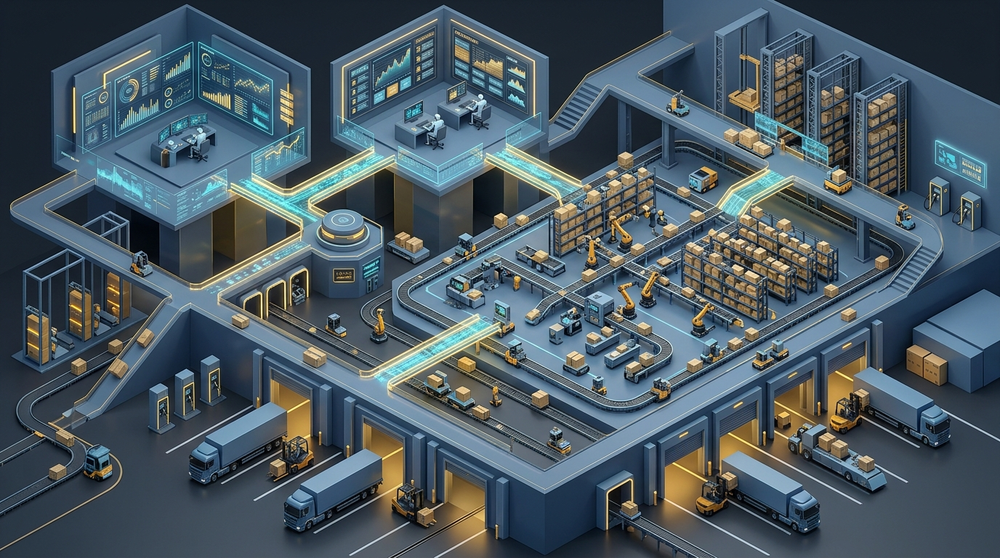

# AI Agent dalam Manajemen Rantai Pasok dan Logistik

Oleh Khohar Rohman | Diperbarui: 1 Oktober 2026


*Gambar 1: Ruang kendali logistik otonom modern memanfaatkan kolaborasi agen kecerdasan artifisial untuk memantau rute pengapalan global, tingkat stok pergudangan, dan distribusi armada secara real-time.*

> ### Key Takeaways
> *   **Transformasi Menuju Self-Healing Logistics:** Penggunaan sistem *Multi-Agent Systems* (MAS) mengubah manajemen rantai pasok (*Supply Chain Management* / SCM) dari sistem analitik prediktif yang pasif menjadi ekosistem otonom yang mampu mendeteksi disrupsi rute dan memulihkan pasokan secara mandiri (*self-healing*) tanpa keterlambatan birokrasi manual.
> *   **Efisiensi Terbukti Berbasis Riset McKinsey:** Perusahaan dengan maturitas agen AI tinggi di lini operasional rantai pasok berhasil memangkas nilai persediaan barang (*inventory*) sebesar 20–30%, menekan ongkos logistik 5–20%, dan menghemat belanja pengadaan 5–15%.
> *   **Mitigasi Fenomena "Agent Bullwhip Effect":** Riset pemodelan rantai pasok 2026 mengungkap bahwa pendelegasian keputusan otonom tanpa koordinasi sistemik berisiko memperparah efek cambuk (*bullwhip effect*), sehingga membutuhkan algoritma pencari konsensus (*consensus-seeking*) dan pembatas batas aman operasional (*safety dampeners*).
> *   **Tata Kelola Proporsional (*Proportional Governance*):** Untuk mengantisipasi peringatan Gartner mengenai risiko de-eskalasi proyek agen AI pada 2027, korporasi wajib menerapkan batasan nilai transaksi moneter dan gerbang persetujuan manusia (*Human-in-the-Loop*) untuk kontrak pengadaan bernilai strategis.

---

## Dari Rantai Pasok Statis Menuju Ekosistem Otonom Berbasis Agen

Manajemen rantai pasok modern menghadapi era volatilitas tertinggi dalam sejarah perdagangan global [1]. Disrupsi jalur pelayaran lintas benua, cuaca ekstrem, fluktuasi geopolitik, hingga ketidakpastian permintaan pasar konsumen menelanjangi kelemahan mendasar dari perangkat lunak *Enterprise Resource Planning* (ERP) dan manajemen transportasi konvensional [1, 2]. 

Selama beberapa dekade, perusahaan mengandalkan otomatisasi berbasis aturan kaku (*rule-based automation*) atau perangkat *Robotic Process Automation* (RPA) sederhana [2]. Ketika terjadi kondisi yang menyimpang dari skenario yang telah diprogram—seperti pelabuhan transit yang ditutup tiba-tiba atau pemasok utama yang mengalami kelangkaan bahan baku—sistem konvensional hanya mampu membunyikan peringatan pasif (*alerts*), memaksa para manajer rantai pasok menghabiskan waktu berhari-hari dalam rapat darurat untuk mencari solusi alternatif secara manual [2, 8].

Sebagaimana telah dibahas dalam analisis [Transformasi Lanskap Kecerdasan Artifisial](Artikel%20Blog%20Pemanfaatan%20AI.md), lompatan produktivitas sejati hanya tercapai ketika teknologi cerdas mampu merombak alur kerja secara mendasar [10]. Dalam domain operasional logistik, perombakan ini dimotori oleh transisi dari AI percakapan menuju **Autonomous AI Agents** [1, 2]. 

Berbeda dengan otomatisasi deterministik, agen AI memiliki tiga kapabilitas kognitif mutakhir: kemampuan mempersepsikan perubahan lingkungan data secara dinamis (*context perception*), melakukan penalaran multi-langkah (*multi-step reasoning*), dan mengeksekusi aksi nyata melintasi batas-batas sistem pergudangan (*Warehouse Management System* / WMS), transportasi (*Transportation Management System* / TMS), serta pengadaan korporat [1, 7].

---

## Arsitektur Multi-Agent Systems (MAS) dalam Operasional Logistik

Operasional rantai pasok berskala enterprise mustahil dikendalikan oleh satu agen monolitik raksasa [1, 5]. Rantai pasok terdiri dari entitas-entitas yang memiliki tujuan berbeda dan kerap saling bertentangan: tim pengadaan menginginkan harga pembelian serendah mungkin dengan memesan dalam volume besar, sementara tim pergudangan menginginkan persediaan seminimal mungkin demi memangkas biaya simpan modal kerja [2, 4].

Oleh karena itu, arsitektur terbaik dibangun menggunakan ekosistem **Multi-Agent Systems (MAS)** yang terdesentralisasi namun terkoordinasi secara cerdas [4, 5].

```
+-------------------------------------------------------------------------------+
|                       ORCHESTRATION & SUPPLY CHAIN GRAPH                      |
|           (Pusat Penyeimbang Tujuan Sistemik & Pengawas Kepatuhan)            |
+---------------------------------------+---------------------------------------+
                                        |
     +------------------+---------------+----------------+------------------+
     |                  |                                |                  |
     v                  v                                v                  v
+-----------+    +---------------+                       +---------------+  +---------------+
|PROCUREMENT|    |   INVENTORY   |                       |    FREIGHT    |  | RISK SENTINEL |
|   AGENT   |    | OPTIMIZER AGT |                       |  DISPATCH AGT |  |     AGENT     |
+-----+-----+    +-------+-------+                       +-------+-------+  +-------+-------+
      |                  |                                       |                  |
      +------------------+---------------+-----------------------+------------------+
                                         |
                            Standar Antarmuka Terbuka
                       [ Model Context Protocol (MCP) ]
                                         |
    +-----------------+------------------+-------------------+------------------+
    |                 |                                      |                  |
    v                 v                                      v                  v
[ Sistem ERP ]  [ Sistem WMS Gudang ]                  [ Sistem TMS Armada ] [ Data Satelit/API]
```

### 1. Taksonomi Peran Agen Spesialis
Dalam kerangka kerja multi-agen logistik, setiap agen diberikan fokus domain fungsional yang spesifik [2, 5]:
*   **Procurement Agent (Agen Pengadaan):** Memantau fluktuasi harga bahan baku di bursa komoditas dan katalog vendor. Ketika stok mendekati batas pemesanan ulang (*reorder point*), agen ini secara otonom menerbitkan permintaan penawaran (*Request for Quotation* / RFQ), mengevaluasi proposal harga pemasok, dan menegosiasikan diskon volume berdasarkan batas toleransi yang ditetapkan manajemen [2].
*   **Inventory Optimizer Agent (Agen Optimasi Persediaan):** Menghitung ukuran stok penyangga (*buffer stock*) secara dinamis menggunakan pemodelan probabilistik variabel cuaca, tren musiman, dan hari libur nasional, alih-alih angka persediaan statis [4, 5].
*   **Freight Dispatcher Agent (Agen Disposisi Armada):** Memilih kombinasi rute transportasi intermodal (darat, laut, udara) yang paling efisien, mengonsolidasikan muatan kontainer (*Less than Container Load* / LCL), serta memantau jadwal kedatangan armada secara *real-time* [6].
*   **Risk Sentinel Agent (Agen Pengawas Risiko):** Menganalisis sumber data eksternal—seperti berita cuaca satelit maritim, pemogokan buruh pelabuhan, dan peringatan kepabeanan digital—untuk mendeteksi potensi kemacetan sebelum dampak fisik terjadi [6].

### 2. Integrasi Data Lintas Sistem via Model Context Protocol (MCP)
Sebagaimana dijelaskan dalam kajian mendalam mengenai [Model Context Protocol (MCP) dan Arsitektur Multi-Agent AI](model-context-protocol-multi-agent-enterprise.md), kompleksitas integrasi sistem rantai pasok selama ini terkendala oleh masalah fragmentasi $N \times M$ [9]. Dengan membungkus endpoint ERP warisan (seperti SAP atau Oracle), sensor IoT kontainer, dan platform pelacakan GPS ke dalam standar kontrak *Tools* dan *Resources* MCP, agen-agen otonom dapat saling bertukar data secara instan tanpa perlu rekayasa konektor khusus yang rapuh [1, 9].


*Gambar 2: Arsitektur Multi-Agent System (MAS) di fasilitas pergudangan pintar: koordinasi otonom antara agen peramalan stok, agen pengadaan, robot pemilah inventaris, dan armada pengiriman.*

---

## Mekanisme Self-Healing Supply Chain: Menangani Disrupsi Tanpa Henti

Puncak evolusi dari implementasi agen AI dalam logistik adalah terwujudnya **Self-Healing Supply Chain (Rantai Pasok yang Memulihkan Diri Sendiri)** [1, 8]. Ini adalah kapabilitas di mana ekosistem operasional mampu mengenali, mendiagnosis, dan menyelesaikan anomali rantai pasok secara mandiri dalam hitungan menit, bukan hari [8].

Siklus *Self-Healing* bekerja melalui empat tahap berkesinambungan [1, 8]:
1.  **Autonomous Detection (Deteksi Dini Otonom):** *Risk Sentinel Agent* mendeteksi bahwa sebuah kapal kontainer yang mengangkut komponen mikroprosesor penting mengalami keterlambatan 96 jam akibat badai di Selat Malaka [6, 8].
2.  **Impact Simulation & Digital Twin (Simulasi Dampak):** Informasi tersebut langsung diteruskan ke replika digital (*Digital Twin*) pabrik perakitan. Sistem menghitung bahwa tanpa pasokan tersebut, lini produksi otomotif akan terhenti dalam waktu 48 jam ke depan dengan estimasi kerugian $350.000 per hari [6].
3.  **Collaborative Mitigation (Pencarian Solusi Kolaboratif):** *Inventory Agent* segera memeriksa ketersediaan stok komponen serupa di tiga gudang penyangga regional terdekat. Pada saat yang sama, *Procurement Agent* menghubungi pemasok sekunder via API untuk memesan slot komponen darurat melalui kargo udara [2, 8].
4.  **Autonomous Execution & Notification (Eksekusi Mandiri & Pelaporan):** Setelah menghitung bahwa biaya kargo udara darurat jauh lebih murah daripada menghentikan pabrik, agen secara otomatis menerbitkan pesanan darurat, mengatur jadwal penjemputan truk logistik lokal, dan mengirimkan ringkasan mitigasi lengkap ke dasbor manajer rantai pasok [1, 8].

---

## Bahaya "Agent Bullwhip Effect" dan Cara Menjinakkannya

Kendati otonomi agen menjanjikan efisiensi luar biasa, kebebasan agen yang tidak terkontrol membawa bahaya sistemik yang sangat nyata [3]. Fenomena klasik dalam ilmu rantai pasok yang dikenal sebagai **efek cambuk (*bullwhip effect*)**—di mana fluktuasi permintaan kecil di tingkat konsumen akhir membesar secara eksponensial menjadi distorsi pesanan raksasa di tingkat produsen hulu—kini menemukan wujud barunya: **Agent Bullwhip Effect** [3, 4].


*Gambar 3: Dasbor pemantauan telemetri real-time yang memadukan peredam algoritma (algorithmic stabilization dampeners) dan pos verifikasi manusia (Human-in-the-Loop) untuk menstabilkan osilasi pesanan agen.*

Dalam riset empiris terbaru yang dipublikasikan oleh Zhang, Wang, & Liu (2026) melalui simulasi *MIT Beer Game* dengan agen AI generatif otonom, ditemukan bahwa ketika agen-agen LLM beroperasi secara independen untuk meminimalkan biaya masing-masing (*selfish optimization*), instabilitas keputusan agen justru memperparah osilasi pesanan hingga 3,2 kali lipat lebih buruk dibanding keputusan manusia [3]. Agen cenderung bereaksi berlebihan (*over-reacting*) terhadap kekurangan stok sementara dengan melipatgandakan pesanan pembelian secara panik [3].

Untuk menjinakkan instabilitas ini, studi Al-Mubaid & Chen (2025) dalam *International Journal of Production Research* merekomendasikan dua pilar mitigasi arsitektur [4]:
*   **Multi-Agent Consensus-Seeking:** Agen tidak diizinkan mengeluarkan pesanan pengadaan sepihak hanya berdasarkan pandangan lokal. Agen wajib menjalankan protokol pencarian konsensus lintas tingkat (*cross-echelon consensus*), di mana sinyal permintaan konsumen riil dibagikan secara transparan ke seluruh lapis pemasok guna meredam spekulasi [4].
*   **Algorithmic Safety Dampeners (Peredam Kecepatan Pesanan):** Memberlakukan parameter pembatas (*rate limiters*) pada algoritma yang membatasi perubahan volume pemesanan mendadak (misalnya maksimum lonjakan 15% per siklus pesanan) kecuali telah divalidasi oleh data anomali eksternal yang terverifikasi [3, 4].

| Dimensi Perbandingan | Manajemen Rantai Pasok Tradisional | Autonomous Multi-Agent SCM Modern |
| :--- | :--- | :--- |
| **Pola Respons Masalah** | Reaktif (menunggu rapat evaluasi mingguan) | Proaktif & *Real-Time* (deteksi dan mitigasi seketika) |
| **Karakteristik Aturan** | Deterministik statis (*if-else thresholds*) | Kognitif adaptif (*probabilistic multi-step reasoning*) |
| **Siklus Negosiasi Vendor** | Manual via email & telepon (2–5 hari kerja) | Otomatis via lelang mikro antar agen (hitungan menit) |
| **Stok Penyangga (*Buffer*)** | Statis berdasarkan asumsi musiman historis | Dinamis disesuaikan secara harian per kondisi riil |
| **Mitigasi Efek Cambuk** | Bergantung pada peramalan deret waktu berkala | Reduksi distorsi via konsensus data multi-agen |

---

## Proyeksi Nilai Bisnis & Data Pasar 2026–2030

Penerapan sistem agen otonom pada rantai pasok bukan lagi sekadar proyek riset laboratorium teknologi, melainkan telah menjadi pembeda keunggulan kompetitif di panggung bisnis global [1, 2].

Menurut laporan riset pasar **Gartner (2026)**, nilai pasar perangkat lunak manajemen rantai pasok yang mengintegrasikan fitur agen otonom diproyeksikan melonjak dari **di bawah $2 Miliar pada tahun 2025 menjadi $53 Miliar pada tahun 2030** [1]. Gartner juga memperkirakan bahwa pada tahun 2030, sebanyak **60% korporasi enterprise** akan mengadopsi kapabilitas agen AI dalam perangkat lunak rantai pasok mereka, melonjak signifikan dari angka penetrasi yang hanya 5% pada tahun 2025 [1].

Dampak finansial dari transformasi ini dikonfirmasi oleh temuan riset global **McKinsey & Company (2025/2026)** terhadap korporasi multinasional yang telah mengimplementasikan AI operasional tingkat lanjut [2]:
*   **Pengurangan Nilai Persediaan (*Inventory Reduction*):** Pemotongan nilai stok barang sebesar **20% hingga 30%** tanpa menurunkan tingkat layanan pelanggan (*service levels*), melepaskan triliunan rupiah modal kerja yang sebelumnya mengendap di gudang [2].
*   **Penurunan Biaya Logistik dan Pengiriman:** Efisiensi sebesar **5% hingga 20%** melalui optimalisasi pengisian kontainer, pemilihan rute multimodal, dan penghindaran biaya demurrage pelabuhan [2].
*   **Penghematan Belanja Pengadaan Barang:** Penurunan nilai belanja pengadaan langsung maupun tidak langsung sebesar **5% hingga 15%** berkat negosiasi harga dinamis dan penegakan kepatuhan kontrak pemasok secara otomatis [2].

---

## Kerangka Tata Kelola Proporsional dan Kepatuhan Kontrak Pengadaan

Di tengah potensi keuntungan ekonomi yang masif, lembaga riset **Gartner memperingatkan bahwa hingga 40% enterprise berisiko menurunkan atau menghentikan proyek agen AI mereka sebelum akhir 2027** apabila tidak dibentengi oleh tata kelola yang memadai [1]. Risiko terbesar dalam logistik otonom adalah fenomena *"runaway agent actions"*—misalnya agen pengadaan yang secara keliru memesan jutaan bahan baku akibat distorsi data input [1, 3].

Untuk menjaga integritas operasional dan kepatuhan hukum korporat, manajemen wajib menerapkan kerangka **Tata Kelola Proporsional (*Proportional Governance*)** [1]:

```
+-------------------------------------------------------------------------------+
|                    PIRAMIDA OTORISASI PROPORSIONAL SCM                        |
+-------------------------------------------------------------------------------+
| LEVEL 3: TRANSAKSI STRATEGIS (> $50.000 / Kontrak Vendor Baru)                |
| -> Human-in-the-Loop Mutlak: Agen hanya menyusun analisis; Pengesahan Manual |
+---------------------------------------+---------------------------------------+
                                        |
+---------------------------------------v---------------------------------------+
| LEVEL 2: TRANSAKSI OPERASIONAL MENENGAH ($5.000 - $50.000)                    |
| -> Autonomous dengan Notifikasi & Jeda Waktu Pembatalan (1-Hour Time Window)  |
+---------------------------------------+---------------------------------------+
                                        |
+---------------------------------------v---------------------------------------+
| LEVEL 1: TRANSAKSI RUTIN VOLUME TINGGI (< $5.000 / Pengalihan Rute Truk)      |
| -> Otonom Penuh: Agen mengeksekusi langsung; Dicatat di Immutable Audit Log    |
+-------------------------------------------------------------------------------+
```

1.  **Penetapan Ambang Batas Otorisasi Moneter (*Monetary Thresholds*):** Transaksi bernilai rendah (Level 1) dapat dieksekusi secara otonom penuh demi kecepatan. Namun, untuk komitmen pengadaan di atas ambang batas tertentu (Level 3), sistem wajib menerapkan gerbang persetujuan manusia (*Human-in-the-Loop*) di mana kontrak pesanan hanya sah setelah ditandatangani secara digital oleh manajer pengadaan resmi [1].
2.  **Auditabilitas Jejak Keputusan (*Explainable Decision Trail*):** Setiap keputusan agen—seperti mengapa memilih vendor B daripada vendor A, atau mengapa mengubah rute pengiriman laut ke udara—wajib dicatat secara lengkap bersama parameter pemicunya dalam log audit yang tidak dapat diubah (*immutable log*) [1, 6].
3.  **Kepatuhan Kontrak Hukum Dagang:** Mengingat pendelegasian keputusan komersial kepada algoritma masih memiliki celah hukum pembuktian perdata, kontrak kerja sama antar-perusahaan wajib memuat klausul hukum yang mengakui keabsahan pesanan elektronik yang diinisiasi oleh sistem agen otonom terdaftar [4].

---

## Kesimpulan dan Panduan Eksekutif

Sebagaimana ditekankan oleh Khohar Rohman dalam kajian strategi operasional bisnis terintegrasi teknologi, rantai pasok masa depan bukan lagi tentang siapa yang memiliki gudang terbesar atau armada terbanyak, melainkan tentang kecepatan adaptasi sistem kognitif dalam menavigasi ketidakpastian. 

Penerapan Autonomous AI Agents dan arsitektur Multi-Agent Systems (MAS) telah mengubah manajemen rantai pasok dari model reaktif yang lamban menjadi ekosistem yang mampu berpikir, bernegosiasi, dan memulihkan diri secara mandiri (*self-healing*) [1, 8]. Penghematan persediaan hingga 30% dan efisiensi logistik hingga 20% membuktikan bahwa nilai ekonomi AI tidak lagi berada pada ranah wacana, melainkan telah menjadi realitas operasional yang terukur [2].

Namun demikian, para pemimpin bisnis dan perancang teknologi harus bijak dalam menyeimbangkan otonomi mesin dan kendali korporat. Mengabaikan risiko *Agent Bullwhip Effect* atau menyerahkan otorisasi finansial tanpa tata kelola proporsional hanya akan menciptakan instabilitas baru bagi perusahaan [1, 3]. Keberhasilan sejati transformasi rantai pasok modern terletak pada orkestrasi yang harmonis: membiarkan agen AI mengeksekusi kerumitan komputasi logistik harian berlatensi tinggi, sementara kepemimpinan strategis dan batas etika bisnis tetap berada di bawah kendali manusia [1, 4, 10].

---

## Pertanyaan yang Sering Diajukan (FAQ)

### 1. Apa perbedaan mendasar antara otomatisasi logistik berbasis aturan (RPA) dan agen AI otonom?
RPA dan sistem aturan konvensional hanya mampu mengeksekusi alur kerja linear deterministik yang sudah ditentukan sebelumnya (*if-this-then-that*). Jika terjadi anomali baru yang tidak terdaftar dalam aturan, sistem akan gagal atau berhenti. Sebaliknya, agen AI otonom memiliki kemampuan penalaran kontekstual berbasis model bahasa: agen dapat mengevaluasi skenario yang belum pernah dihadapi sebelumnya, mempertimbangkan berbagai opsi solusi, dan bernegosiasi dengan sistem lain untuk memecahkan masalah logistik secara mandiri [1, 2].

### 2. Bagaimana agen AI memitigasi distorsi pesanan (Bullwhip Effect) pada rantai pasok?
Agen AI memitigasi efek cambuk melalui mekanisme transparansi data multi-agen (*multi-agent consensus-seeking*). Alih-alih setiap tingkat rantai pasok menduga-duga volume permintaan berdasarkan pesanan perantara, agen saling berbagi sinyal konsumsi riil konsumen akhir secara terenkripsi, disertai penggunaan algoritma peredam (*safety dampeners*) yang mencegah lonjakan pesanan panik [3, 4].

### 3. Apakah agen otonom dapat melakukan transaksi pemesanan barang tanpa izin manusia?
Bisa, namun hanya untuk transaksi operasional rutin bernilai rendah di bawah batas toleransi yang ditetapkan manajemen (misalnya pemesanan ulang suku cadang rutin di bawah ambang batas tertentu). Untuk transaksi pengadaan bernilai besar atau perubahan kontrak vendor jangka panjang, tata kelola proporsional mewajibkan arsitektur *Human-in-the-Loop*, di mana agen hanya bertindak sebagai analis penyusun rekomendasi dan eksekusi final membutuhkan otorisasi manajer manusia [1].

---

## Diskusi dan Tanggapan Anda

Bagaimana kesiapan infrastruktur logistik dan rantai pasok di perusahaan Anda dalam menghadapi disrupsi pasar global saat ini? Apakah organisasi Anda telah mulai menguji penerapan agen AI otonom dalam alur kerja pengadaan atau pergudangan, ataukah masih mengandalkan perangkat lunak ERP tradisional?

Tuliskan pengalaman, kendala operasional, dan pandangan Anda di kolom komentar di bawah ini untuk memperluas diskusi manajemen rantai pasok cerdas.

---

## Tentang Penulis

**Khohar Rohman** adalah Direktur PT Aigarn Akademi Artificial dan mahasiswa aktif Politeknik Negeri Malang. Ia mendedikasikan riset dan publikasinya pada arsitektur kecerdasan artifisial terapan, transformasi operasional korporat, otomatisasi rantai pasok, dan manajemen bisnis berbasis teknologi.

*Tautan Profil:* [LinkedIn](https://www.linkedin.com) | [GitHub](https://github.com/khohar25) | [Google Scholar](https://scholar.google.com)

*Keterbukaan Informasi:* Penulis adalah direktur PT Aigarn Akademi Artificial. Artikel ini disusun secara independen untuk tujuan edukasi profesional dan kajian arsitektur teknologi tanpa bentuk promosi komersial terselubung.

---

## Kredit Gambar

1.  **Nama File:** `assets/ai-agent-supply-chain-hero.jpg`  
    **Deskripsi:** Ilustrasi 3D ruang kendali logistik otonom dan rantai pasok global yang dipantau oleh agen AI kolaboratif.  
    **Pembuat:** Tim Redaksi Artikel Khohar Rohman (AI-Generated via Custom Enterprise Prompt).  
    **Lisensi:** Domain Publik / Creative Commons Zero (CC0) Dedication. Bebas digunakan untuk keperluan edukasi dan komersial tanpa royalti.
2.  **Nama File:** `assets/multi-agent-inventory-coordination.jpg`  
    **Deskripsi:** Visualisasi arsitektur koordinasi multi-agen di fasilitas pergudangan pintar yang menghubungkan peramalan inventaris, pengadaan, dan robotika logistik.  
    **Pembuat:** Tim Redaksi Artikel Khohar Rohman (AI-Generated via Custom Enterprise Prompt).  
    **Lisensi:** Domain Publik / Creative Commons Zero (CC0) Dedication. Bebas digunakan untuk keperluan edukasi dan komersial tanpa royalti.
3.  **Nama File:** `assets/tata-kelola-agent-bullwhip-mitigasi.jpg`  
    **Deskripsi:** Dasbor telemetri kontrol risiko rantai pasok yang menampilkan peredam osilasi pesanan agen dan pos persetujuan manusia (Human-in-the-Loop).  
    **Pembuat:** Tim Redaksi Artikel Khohar Rohman (AI-Generated via Custom Enterprise Prompt).  
    **Lisensi:** Domain Publik / Creative Commons Zero (CC0) Dedication. Bebas digunakan untuk keperluan edukasi dan komersial tanpa royalti.

---

## Sumber / Daftar Pustaka

1. Gartner. (2026). *Gartner Top Strategic Technology Trends for Supply Chain in 2026: Agentic AI and Autonomous SCM*. Gartner Research Publications. https://www.gartner.com. (Diakses: 1 Oktober 2026).
2. McKinsey & Company. (2025). *Transforming Supply Chains with Generative and Agentic AI: From Predictive Insights to Autonomous Execution*. McKinsey Operations Practice Report. https://www.mckinsey.com. (Diakses: 1 Oktober 2026).
3. Zhang, H., Wang, J., & Liu, X. (2026). *Reliability and Effectiveness of Autonomous AI Agents in Supply Chain Management: Experimental Evidence from Multi-Echelon Simulation*. arXiv preprint arXiv:2602.08412. https://doi.org/10.48550/arXiv.2602.08412. (Diakses: 1 Oktober 2026).
4. Al-Mubaid, H., & Chen, R. (2025). *Agentic LLMs in the Supply Chain: Towards Autonomous Multi-Agent Consensus-Seeking and Bullwhip Mitigation*. International Journal of Production Research, 63(8), 1420–1438. https://doi.org/10.1080/00207543.2025.2415890. (Diakses: 1 Oktober 2026).
5. Tan, Y., & Kumar, S. (2026). *AI Agent Systems for Supply Chains: Structured Decision Prompts and Memory Retrieval (AIM-RM)*. In Proceedings of the 25th International Conference on Autonomous Agents and Multiagent Systems (AAMAS 2026), Auckland, New Zealand. (Diakses: 1 Oktober 2026).
6. Papadopoulos, C., & Gunasekaran, A. (2026). *Autonomous and Agentic AI with Digital Twins for Resilient Transportation and Smart Logistics*. Systems (MDPI), 14(2), 118. https://doi.org/10.3390/systems14020118. (Diakses: 1 Oktober 2026).
7. IBM Institute for Business Value. (2025). *The CEO’s Guide to Generative AI in the Supply Chain: Orchestrating Autonomous Ecosystems*. IBM Thought Leadership. https://www.ibm.com. (Diakses: 1 Oktober 2026).
8. Icron Technologies. (2026). *The Autonomous Self-Healing Supply Chain: Architecture, Mechanics, and Real-World Case Studies*. SCM Whitepaper Series. https://icrontech.com. (Diakses: 1 Oktober 2026).
9. Rohman, K. (2026). *Model Context Protocol (MCP) dan Arsitektur Multi-Agent AI*. Artikel Khohar Rohman. https://artikel.khoharrohman.my.id/model-context-protocol-multi-agent-enterprise. (Diakses: 1 Oktober 2026).
10. Rohman, K. (2026). *Transformasi Lanskap Kecerdasan Artifisial: Analisis Paradoks Produktivitas, Adopsi Lintas Sektor, dan Tata Kelola Berkelanjutan*. Artikel Khohar Rohman. https://artikel.khoharrohman.my.id/Artikel%20Blog%20Pemanfaatan%20AI.md. (Diakses: 1 Oktober 2026).
