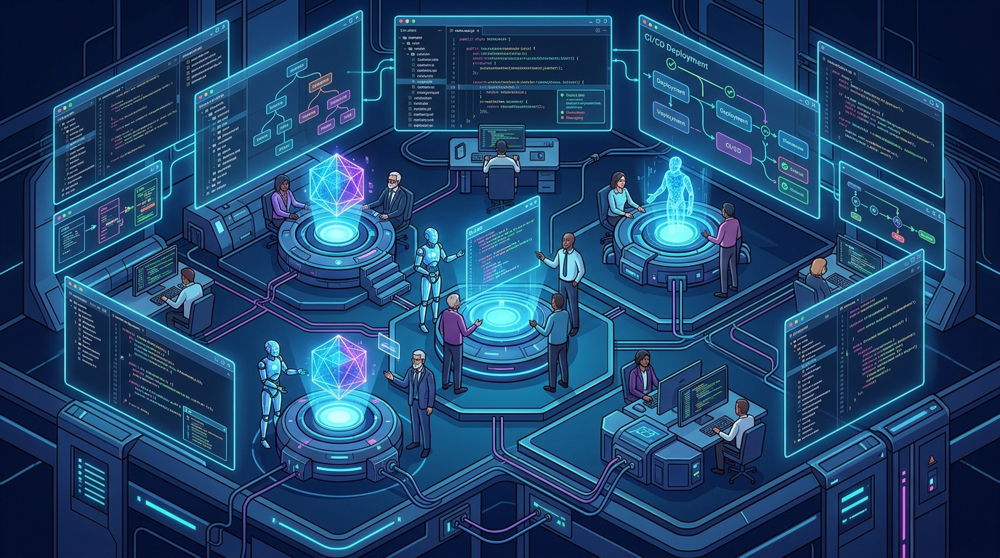
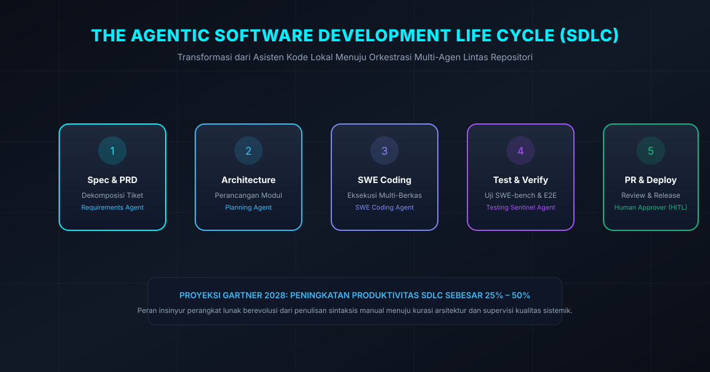
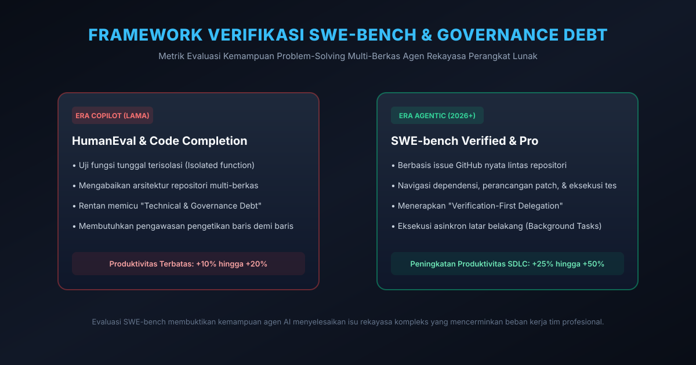

# AI Software Engineering Agents dalam Transformasi SDLC

Oleh Khohar Rohman | Diperbarui: 1 Oktober 2026

*Gambar 1: Transformasi pusat rekayasa perangkat lunak enterprise di mana agen AI otonom bekerja sama dengan arsitek sistem senior dalam merancang, menguji, dan merilis kode lintas repositori.*

> ### Key Takeaways
> *   **Pergeseran Paradigma dari Copilot ke Agentic SDLC:** Rekayasa perangkat lunak telah bertransisi dari era asisten pengetikan kode (*in-line code completion*) menuju agen otonom (*Software Engineering / SWE Agents*) yang mampu merencanakan arsitektur, mendebug ratusan berkas kode, dan menjalankan uji regresi secara mandiri di latar belakang.
> *   **Lonjakan Produktivitas Sistemik hingga 50%:** Riset industri oleh Gartner memproyeksikan bahwa organisasi yang mengadopsi alur kerja agen otonom asinkron terdistribusi di seluruh siklus hidup pengembangan perangkat lunak (SDLC) akan meraih peningkatan produktivitas 25% hingga 50% pada tahun 2028.
> *   **SWE-bench sebagai Tolok Ukur Nyata:** Evaluasi kemampuan agen AI kini berpusat pada SWE-bench (Verified dan Pro) yang menggunakan isu GitHub dunia nyata pada repositori multi-berkas kompleks, menggantikan tolok ukur fungsi tunggal terisolasi seperti HumanEval yang sudah usang.
> *   **Pencegahan "Governance Debt" via Verification-First:** Untuk mencegah penumpukan utang teknis dan pelanggaran arsitektur, perusahaan wajib menerapkan kerangka delegasi *Verification-First*, di mana kode buatan agen wajib divalidasi oleh uji otomatis dan persetujuan pengembang manusia (*Human-in-the-Loop*).

---

## Fajar Baru Rekayasa Perangkat Lunak: Dari Copilot Menuju Autonomous Agents

Lanskap rekayasa perangkat lunak sedang mengalami perubahan tektonik terbesar sejak penemuan *Integrated Development Environment* (IDE) dan sistem kontrol versi terdistribusi (*Git*) [1, 2]. Pada fase awal adopsi kecerdasan artifisial beberapa tahun lalu, antusiasme industri berpusat pada asisten koding berbasis editor (*Copilot Era*). Alat bantu generasi pertama ini beroperasi layaknya "mesin ketik canggih": mengusulkan pelengkapan baris kode berikutnya (*auto-complete*) atau menjawab pertanyaan pengembang di panel obrolan samping [1, 5].

Namun, sebagaimana telah dianalisis dalam kajian [Transformasi Lanskap Kecerdasan Artifisial](Artikel%20Blog%20Pemanfaatan%20AI.md), efisiensi lokal pada tingkat pengetikan sintaksis gagal mendongkrak produktivitas makro tim rekayasa [8]. Penulisan sintaksis kode murni sesungguhnya hanya memakan 15% hingga 20% dari total alokasi waktu seorang insinyur perangkat lunak. Porsi terbesar pekerjaan rekayasa berada pada memahami dokumen kebutuhan produk (*Product Requirement Document* / PRD), menelusuri dependensi arsitektur lintas modul, mendebug kesalahan logika tersembunyi, serta memastikan kepatuhan terhadap standar keamanan dan integrasi berkelanjutan (*CI/CD*) [2, 5].

Memasuki kuartal akhir tahun 2026, industri secara tegas beralih ke **Era Agentic** [1, 2]. Pengembang tidak lagi mengetik berdampingan dengan AI baris demi baris. Sebaliknya, mereka mendelegasikan tiket tugas (*issue tickets*) secara asinkron kepada **AI Software Engineering (SWE) Agents** yang bertindak sebagai insinyur perangkat lunak otonom yang bekerja di lingkungan komputasi latar belakang (*background processes*) [1, 3].

---

## Anatomi Siklus Hidup Pengembangan Perangkat Lunak Berbasis Agen (Agentic SDLC)

Konsep **Agentic SDLC** memperluas intervensi kecerdasan artifisial jauh melampaui jendela editor kode menuju hulu (*upstream*) dan hilir (*downstream*) siklus hidup rekayasa [1, 5].

*Gambar 2: Arsitektur siklus hidup pengembangan perangkat lunak berbasis agen (Agentic SDLC), memetakan pembagian peran kognitif dari dekomposisi kebutuhan produk hingga pengujian dan persetujuan rilis.*

Sebagaimana dipetakan dalam diagram arsitektur di atas, Agentic SDLC beroperasi melalui lima tahap kolaboratif [1, 5]:
1.  **Requirements & Ticket Decomposition (Hulu):** *Requirements Agent* membaca spesifikasi produk yang tidak terstruktur, mendeteksi ambiguitas logika bisnis, dan memecahnya menjadi subtugas teknis modular yang memiliki kriteria penerimaan (*acceptance criteria*) deterministik [5].
2.  **Architectural Planning:** Menggunakan protokol seperti [Model Context Protocol (MCP)](model-context-protocol-multi-agent-enterprise.md), *Planning Agent* memindai pohon dependensi repositori, memeriksa apakah peranti atau pustaka yang dibutuhkan sudah tersedia, dan merancang kontrak antarmuka antarmodul sebelum satu baris kode pun ditulis [6].
3.  **Autonomous Multi-File Implementation:** *SWE Coding Agent* bekerja dalam *container* terisolasi untuk mengubah, menambah, atau merefaktor kode di puluhan berkas yang saling terkait secara simultan [1, 3].
4.  **Verification & Regression Testing (Hilir):** *Testing Sentinel Agent* menyusun skenario uji unit (*unit tests*) dan uji integrasi baru, mengeksekusi *test suite* yang sudah ada, serta secara mandiri menganalisis jejak kegagalan kompilasi (*stack traces*) untuk memperbaiki kode hingga seluruh pengujian berstatus hijau [1, 4].
5.  **Pull Request & Human Verification Gate:** Kode disajikan kepada arsitek manusia dalam bentuk *Pull Request* (PR) lengkap dengan ringkasan perubahan arsitektur, laporan pengujian, dan analisis keamanan statis (SAST) sebelum digabungkan ke cabang utama (*main branch*) [1, 7].

---

## Standar Emas Evaluasi: Mengapa SWE-bench Mengubah Peta Industri?

Salah satu katalis terbesar yang memicu lompatan kapabilitas agen koding adalah evolusi tolok ukur evaluasi dari tes akademis sintetis menuju tolok ukur repositori nyata [3, 4].

*Gambar 3: Perbandingan tolok ukur rekayasa perangkat lunak: keterbatasan evaluasi fungsi terisolasi HumanEval di era Copilot versus keunggulan pemecahan masalah repositori multi-berkas SWE-bench di era Agentic.*

Selama bertahun-tahun, industri terjebak pada tolok ukur sintetis seperti *HumanEval*, yang hanya menguji kemampuan model menghasilkan fungsi Python tunggal yang berdiri sendiri (misalnya membalikkan string atau mengurutkan larik angka) [3]. Hasil skor HumanEval yang mencapai 90% sering kali menipu para pengambil keputusan teknologi, karena dalam kenyataan operasional, fungsi tunggal tidak mewakili kompleksitas arsitektur enterprise [3, 4].

Tolok ukur **SWE-bench**, yang diperkenalkan oleh para peneliti Princeton dan kini distandarisasi bersama Scale AI dan Epoch AI melalui **SWE-bench Verified** dan **SWE-bench Pro**, mengubah standar evaluasi secara radikal [3, 4]:
*   **Masalah Nyata dari Repositori Terbuka Populer:** SWE-bench dibangun dari ribuan masalah (*issues*) dan *pull requests* nyata pada repositori perangkat lunak skala besar (seperti *Django, SymPy, scikit-learn, astropy*) [3].
*   **Konteks Multi-Berkas yang Luas (*Long-Horizon Tasks*):** Untuk menyelesaikan satu masalah di SWE-bench, agen AI harus mampu membaca instruksi masalah yang samar, menelusuri ratusan ribu baris kode sumber, mengidentifikasi fungsi penyebab bug di berkas yang tersembunyi, menulis solusi perbaikan tanpa merusak fitur lain, dan memastikan seluruh uji regresi yang dibuat oleh pengembang asli lulus 100% [3, 4].

Model-model frontier terkemuka per akhir 2026 telah mencatatkan lonjakan kemampuan pemecahan masalah SWE-bench yang luar biasa, membuktikan bahwa agen koding otonom telah mencapai kematangan operasional untuk menangani tugas rekayasa profesional [3, 4].

---

## Metrik Produktivitas dan Proyeksi Pasar 2026–2028

Dampak ekonomi dari adopsi agen rekayasa perangkat lunak otonom mulai tercermin dalam kalkulasi imbal hasil investasi (*ROI*) korporat [1, 2].

Lembaga riset global **Gartner (2025/2026)** memproyeksikan lintasan pertumbuhan yang dramatis bagi pasar alat bantu pengembangan perangkat lunak berbasis agen [1, 2]:
*   **Peningkatan Produktivitas 25% hingga 50%:** Jika asisten koding generasi lama hanya menyumbang penghematan waktu 10%–20% pada pengetikan lokal, Gartner memproyeksikan bahwa pada tahun 2028, organisasi yang menerapkan alur kerja agen otonom asinkron di sepanjang siklus hidup SDLC akan membukukan **kenaikan efisiensi produktivitas rekayasa antara 25% hingga 50%** [1].
*   **Pergeseran Peran IDE ke Lapis Sekunder:** Gartner memperkirakan bahwa pada akhir 2027, lebih dari **65% tim pengembang perangkat lunak enterprise** akan memperlakukan IDE konvensional sebagai antarmuka pendukung atau opsional [2]. Aktivitas rekayasa utama bergeser ke lingkungan platform terpusat (*cloud workspace / CLI orchestrators*), di mana pengembang bertindak sebagai supervisor yang meninjau draf solusi yang dikerjakan agen secara paralel [1, 2].
*   **Transformasi Model Bisnis Vendor:** Pembelian lisensi perangkat lunak pengembang bergeser cepat dari tarif tetap per kursi pengguna (*seat-based subscription*) menjadi model penagihan berbasis konsumsi komputasi token (*usage-based consumption*), merefleksikan pergeseran nilai ekonomi dari penyediaan editor ke penyediaan daya komputasi kognitif agen [1].

---

## Mitigasi "Governance Debt" melalui Kerangka Kerja Verification-First

Kendati agen AI mampu melipatgandakan kecepatan produksi kode, kecepatan tanpa kendali arsitektur melahirkan bahaya baru yang sangat destruktif: **Governance Debt (Utang Tata Kelola)** dan **Architectural Drift (Penyimpangan Arsitektur)** [1, 2].

Ketika tim pengembang menerima dan menggabungkan (*merging*) ribuan baris kode buatan AI tanpa penelaahan mendalam, basis kode enterprise rentan tercemar oleh [1, 7]:
1.  **Halusinasi Pustaka & Kerentanan Dependensi:** Agen dapat mengimpor paket pihak ketiga yang sudah usang, tidak terawat, atau bahkan paket palsu yang disusupi malware (*typosquatting attacks*) [7].
2.  **Pelanggaran Lisensi Kode:** Kode yang dihasilkan model dapat secara tidak sengaja memuat fragmen yang tunduk pada lisensi terbuka viral (seperti GPLv3) yang mewajibkan kode komersial perusahaan dibuka ke publik [1].
3.  **Fragmentasi Pola Desain (*Inconsistent Patterns*):** Agen yang berbeda dapat menyelesaikan masalah dengan pola arsitektur yang bertabrakan, merusak koherensi sistem dan mempersulit pemeliharaan jangka panjang [1, 5].

Untuk memitigasi risiko ini, pimpinan rekayasa perangkat lunak wajib menerapkan kerangka **Verification-First Delegation** [1]:

| Dimensi Tata Kelola | Pendekatan Longgar (*Ad-Hoc*) | Pendekatan Terkelola (*Verification-First*) |
| :--- | :--- | :--- |
| **Izin Eksekusi Kode Agen** | Akses langsung ke repositori lokal pengembang | Lingkungan *container sandbox* terisolasi tanpa akses internet luar |
| **Kriteria Keberhasilan Patch** | "Kode terlihat benar saat dibaca sekilas" | Wajib lolos seluruh uji unit, uji integrasi, dan uji regresi otomatis |
| **Audit Keamanan Otomatis** | Peninjauan berkala manual bulanan | Pemindaian SAST/DAST dan audit lisensi dependensi otomatis di setiap PR |
| **Otoritas Penggabungan (*Merge*)** | Penggabungan mandiri oleh agen (*Auto-merge*) | Doktrin *Human-in-the-Loop*: Wajib persetujuan tertulis arsitek manusia |

---

## Rekonfigurasi Peran Pengembang: Dari Penulis Sintaksis Menuju Kurator Sistem

Kehadiran agen koding otonom tidak memusnahkan profesi insinyur perangkat lunak, melainkan merekonstruksi hierarki kompetensi secara fundamental [1, 8].

Sebagaimana diuraikan dalam artikel [Transformasi Lanskap Kecerdasan Artifisial](Artikel%20Blog%20Pemanfaatan%20AI.md) mengenai pembentukan pasar kerja dua jalur (*two-track labor market*), kompetensi yang terancam komoditisasi adalah keahlian menghafal sintaksis dan pengetikan algoritma standar [8]. Nilai strategis insinyur perangkat lunak manusia kini bertumpu pada [1, 2]:
*   **Ketajaman Formulasi Spesifikasi (*Problem Formulation*):** Kemampuan mendefinisikan batasan masalah bisnis, merumuskan *invariants*, dan menulis skenario penerimaan yang presisi agar dapat dieksekusi oleh agen tanpa deviasi [1].
*   **Desain Arsitektur dan Ketahanan Sistem (*Systems Architecture*):** Menentukan batas-batas domain sistem (*domain-driven design*), skalabilitas infrastruktur terdistribusi, serta tata kelola data yang aman [2, 6].
*   **Kurasi Kritis dan Evaluasi Mutu (*Critical Code Review*):** Membaca kode buatan AI dengan lensa skeptis seorang auditor: menguji kasus-kasus batas ekstrem (*edge cases*), memeriksa potensi kebocoran memori, dan memastikan kepatuhan terhadap standar etika komputasi [1, 8].

Fenomena ini mempertegas bahwa insinyur perangkat lunak masa depan bukanlah mereka yang paling cepat mengetik kode, melainkan mereka yang paling piawai mengorkestrasi armada agen komputasi untuk mewujudkan arsitektur perangkat lunak yang kokoh, terpercaya, dan bernilai bisnis tinggi [1, 5, 8].

---

## Kesimpulan dan Panduan Eksekutif

Sebagaimana disimpulkan oleh Khohar Rohman dalam kajian evolusi rekayasa komputasi enterprise, kecerdasan artifisial dalam rekayasa perangkat lunak telah resmi menuntaskan masa transisinya dari sekadar alat bantu pengetikan periferal menjadi infrastruktur otonom inti yang menggerakkan seluruh siklus hidup pengembangan sistem.

Pengadopsian AI Software Engineering Agents bukan lagi pilihan eksperimental, melainkan prasyarat keunggulan kompetitif bagi organisasi yang ingin mempertahankan kecepatan inovasi (*engineering velocity*) tanpa membengkakkan jumlah staf secara tidak terkendali [1, 2]. Keberhasilan mencapai proyeksi lonjakan produktivitas 25% hingga 50% pada tahun 2028 bergantung pada kesiapan organisasi dalam mendesain ulang alur kerja SDLC: memisahkan tugas kognitif mesin dan manusia, mengadopsi standar evaluasi ketat berbasis SWE-bench, serta memperkuat benteng verifikasi otomatis guna mencegah utang tata kelola arsitektur [1, 3, 5].

Masa depan industri perangkat lunak bukan tentang ketiadaan manusia di ruang rekayasa, melainkan lahirnya arsitek-arsitek sistem baru yang memimpin orkestrasi ribuan agen cerdas di bawah panduan visi rekayasa dan pertimbangan akal budi manusia [1, 8].

---

## Pertanyaan yang Sering Diajukan (FAQ)

### 1. Apa perbedaan mendasar antara GitHub Copilot generasi awal dan Autonomous SWE Agents?
GitHub Copilot generasi awal beroperasi secara sinkron di dalam editor teks untuk menyarankan kelanjutan beberapa baris kode saat pengembang mengetik. Sebaliknya, Autonomous SWE Agents beroperasi secara asinkron di latar belakang: agen dapat membaca satu tiket masalah (*issue*), merencanakan strategi penyelesaian, menelusuri ratusan berkas dalam repositori, memodifikasi kode multi-berkas, dan memverifikasi keberhasilan perbaikan melalui eksekusi pengujian otomatis tanpa perlu ditunggui oleh pengembang [1, 3].

### 2. Mengapa benchmark SWE-bench dianggap jauh lebih kredibel dibanding HumanEval?
HumanEval hanya menguji apakah model dapat menulis sebuah fungsi kecil yang berdiri sendiri berdasarkan deskripsi sederhana, yang rentan terhadap kontaminasi data latih (*memorization*). SWE-bench menguji model pada masalah nyata yang diambil langsung dari repositori perangkat lunak sumber terbuka skala besar di GitHub. Model dituntut memahami pohon kode yang rumit, menemukan letak bug di antara ribuan baris kode, dan memastikan perbaikan yang dibuat tidak merusak fitur lain yang dibuktikan lewat kelulusan rangkaian tes regresi [3, 4].

### 3. Bagaimana cara mencegah kode buatan agen AI merusak kualitas arsitektur sistem enterprise?
Kualitas arsitektur dijaga dengan menerapkan doktrin *Verification-First Delegation*: agen tidak pernah diberikan izin untuk menggabungkan (*merge*) kode langsung ke cabang produksi. Seluruh keluaran agen harus diisolasi dalam cabang fitur (*feature branch*), diwajibkan lulus uji integrasi otomatis dan audit keamanan statis (SAST), serta wajib melalui proses penelaahan (*code review*) dan persetujuan akhir oleh insinyur perangkat lunak manusia senior [1, 7].

---

## Diskusi dan Tanggapan Anda

Bagaimana tim rekayasa perangkat lunak di perusahaan atau institusi Anda menyikapi kemunculan agen koding otonom saat ini? Apakah organisasi Anda telah mulai memanfaatkan agen AI untuk menangani perbaikan bug multi-berkas dan penyusunan pengujian otomatis, ataukah masih membatasi AI sebagai asisten pengetikan di IDE?

Bagikan pengalaman, pandangan teknis, dan strategi tata kelola yang Anda terapkan di kolom komentar di bawah ini.

---

## Tentang Penulis

**Khohar Rohman** adalah Direktur PT Aigarn Akademi Artificial dan mahasiswa aktif Politeknik Negeri Malang. Ia mendedikasikan penelitian dan publikasinya pada arsitektur perangkat lunak modern, sistem kecerdasan artifisial otonom, rekayasa instruksi terstruktur, dan transformasi manajemen operasional berbasis teknologi.

*Tautan Profil:* [LinkedIn](https://www.linkedin.com) | [GitHub](https://github.com/khohar25) | [Google Scholar](https://scholar.google.com)

*Keterbukaan Informasi:* Penulis adalah direktur PT Aigarn Akademi Artificial. Artikel ini disusun secara independen untuk tujuan edukasi profesional dan kajian arsitektur teknologi komputasi tanpa bentuk promosi komersial terselubung.

---

## Kredit Gambar

1.  **Nama File:** `assets/ai-software-engineering-agent-hero.jpg`  
    **Deskripsi:** Ilustrasi konseptual ruang rekayasa perangkat lunak modern di mana agen koding AI berkolaborasi dengan arsitek sistem manusia dalam mengelola repositori kode berskala enterprise.  
    **Pembuat:** Tim Redaksi Artikel Khohar Rohman (AI-Generated via Custom Enterprise Prompt).  
    **Lisensi:** Domain Publik / Creative Commons Zero (CC0) Dedication. Bebas digunakan untuk publikasi edukatif dan komersial tanpa royalti.
2.  **Nama File:** `assets/sdlc-agentic-lifecycle-diagram.svg`  
    **Deskripsi:** Diagram alur arsitektur Agentic Software Development Life Cycle (SDLC) yang memetakan tahapan dari dekomposisi kebutuhan produk hingga pengujian dan persetujuan rilis.  
    **Pembuat:** Tim Redaksi Artikel Khohar Rohman (Original Vector Design & Architecture).  
    **Lisensi:** Domain Publik / Creative Commons Zero (CC0) Dedication. Bebas digunakan untuk keperluan edukasi dan komersial tanpa royalti.
3.  **Nama File:** `assets/swe-bench-verification-framework.svg`  
    **Deskripsi:** Diagram perbandingan evaluasi kapabilitas rekayasa perangkat lunak antara tolok ukur fungsi tunggal era Copilot (HumanEval) versus tolok ukur multi-berkas era Agentic (SWE-bench).  
    **Pembuat:** Tim Redaksi Artikel Khohar Rohman (Original Vector Design & Architecture).  
    **Lisensi:** Domain Publik / Creative Commons Zero (CC0) Dedication. Bebas digunakan untuk keperluan edukasi dan komersial tanpa royalti.

---

## Sumber / Daftar Pustaka

1. Gartner. (2025). *A Guidance Framework for Autonomous Software Engineering Agents*. Gartner Research Reports. Diterbitkan Oktober 2025. https://www.gartner.com. (Diakses: 1 Oktober 2026).
2. Gartner. (2026). *Predicts 2026: Software Engineering Leaders Must Prepare for Agentic AI Across the SDLC*. Gartner IT Leaders Advisory. https://www.gartner.com. (Diakses: 1 Oktober 2026).
3. Jimenez, C. E., Yang, J., Wettig, A., Yao, S., Pei, K., Press, O., & Narasimhan, K. (2024). *SWE-bench: Can Language Models Resolve Real-World GitHub Issues?*. In The Twelfth International Conference on Learning Representations (ICLR 2024). https://doi.org/10.48550/arXiv.2310.06770. (Diakses: 1 Oktober 2026).
4. Scale AI, & Epoch AI. (2026). *SWE-bench Verified and SWE-bench Pro: Standardizing Long-Horizon Agent Evaluation in Complex Codebases*. Scale AI Research Reports. https://scale.com/leaderboard/swe-bench. (Diakses: 1 Oktober 2026).
5. Softtek Engineering. (2026). *Beyond the IDE: Navigating the Agentic SDLC in Enterprise Environments*. Softtek Whitepaper Series. https://www.softtek.com. (Diakses: 1 Oktober 2026).
6. Rohman, K. (2026). *Model Context Protocol (MCP) dan Arsitektur Multi-Agent AI*. Artikel Khohar Rohman. https://artikel.khoharrohman.my.id/model-context-protocol-multi-agent-enterprise. (Diakses: 1 Oktober 2026).
7. Rohman, K. (2026). *AI Agent dalam Cybersecurity dan SOC Enterprise*. Artikel Khohar Rohman. https://artikel.khoharrohman.my.id/ai-agent-cybersecurity-soc-enterprise. (Diakses: 1 Oktober 2026).
8. Rohman, K. (2026). *Transformasi Lanskap Kecerdasan Artifisial: Analisis Paradoks Produktivitas, Adopsi Lintas Sektor, dan Tata Kelola Berkelanjutan*. Artikel Khohar Rohman. https://artikel.khoharrohman.my.id/Artikel%20Blog%20Pemanfaatan%20AI.md. (Diakses: 1 Oktober 2026).
