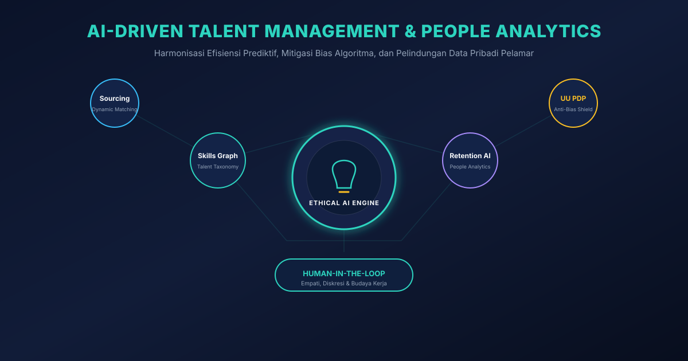
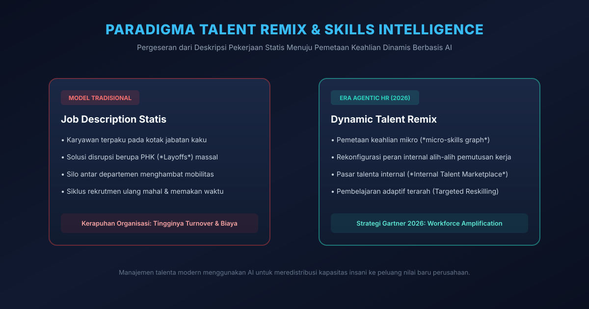
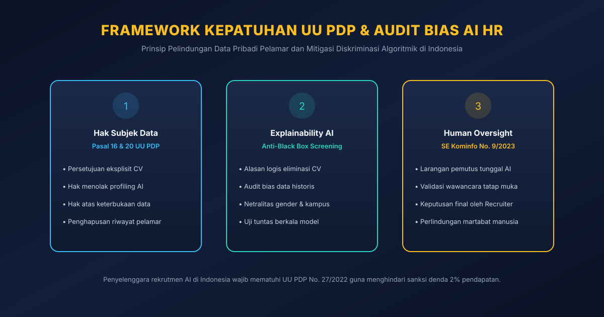

# Manajemen Talenta Berbasis AI: Efisiensi dan Etika

Oleh Khohar Rohman | Diperbarui: 1 Oktober 2026


*Gambar 1: Arsitektur manajemen talenta berbasis kecerdasan artifisial modern yang memadukan efisiensi analitik prediktif, pemetaan keahlian dinamis, dan perisai kepatuhan etika pelindungan data pribadi.*

> ### Key Takeaways
> *   **Transformasi Menuju Dynamic Skills Graph:** Manajemen talenta modern telah bergeser dari pencocokan kata kunci resume yang kaku menuju graf intelijen keahlian (*Skills Intelligence Graph*) yang memetakan potensi kemampuan mikro kandidat secara semantik dan adaptif.
> *   **Strategi "Talent Remix" Gartner 2026:** Daripada melakukan efisiensi reaktif melalui pemutusan hubungan kerja (PHK) massal, korporasi terkemuka memanfaatkan analitik AI untuk memetakan kembali keahlian karyawan internal dan mengalihkannya ke peluang nilai bisnis baru (*workforce amplification*).
> *   **Mitigasi Aktif Bias Algoritmik:** Model AI yang dilatih pada data penerimaan karyawan historis berisiko mengamplifikasi prasangka demografis masa lalu, sehingga menuntut audit disparitas dampak (*disparate impact audit*) secara berkala sebelum sistem digunakan di lantai produksi.
> *   **Hak Pelamar dan Kepatuhan UU PDP No. 27/2022:** Di Indonesia, Pasal 16 & 20 UU PDP melindungi kandidat dari keputusan yang semata-mata diambil oleh pemrosesan otomatis (*automated profiling*), mewajibkan perusahaan membuka alasan eliminasi (*explainability*), serta mempertahankan pengawasan manusia (*Human-in-the-Loop*) sesuai amanat SE Menkominfo No. 9/2023.

---

## Disrupsi Algoritmik dalam Rekrutmen: Antara Kecepatan dan Risiko Diskriminasi

Penerapan kecerdasan artifisial dalam fungsi sumber daya manusia (*Human Resources* / HR) dan manajemen talenta kini telah menjadi pilar utama transformasi digital korporat [1]. Ledakan volume lamaran kerja daring—yang diperparah oleh kemudahan kandidat dalam menghasilkan resume berbasis AI generatif—membuat tim akuisisi talenta (*talent acquisition*) kewalahan [1, 4]. Departemen HR rata-rata menerima ratusan hingga ribuan berkas lamaran untuk satu posisi pekerjaan, menciptakan kemacetan operasional yang parah [1].

Sebagai respon, perusahaan mengadopsi sistem pelacakan pelamar (*Applicant Tracking System* / ATS) berbasis AI yang mampu menyaring ribuan resume dalam hitungan detik [1]. Namun, efisiensi kecepatan ini kerap dibayar mahal oleh munculnya **bias algoritmik sistemik (*systemic algorithmic bias*)** [1, 4].

Sebagaimana telah dianalisis dalam kajian [Transformasi Lanskap Kecerdasan Artifisial](Artikel%20Blog%20Pemanfaatan%20AI.md), algoritma komputasi tidak pernah beroperasi dalam ruang hampa yang bebas nilai; ia mencerminkan data historis yang menjadi bahan pelatihannya [5]. Jika sebuah model AI dilatih pada data keberhasilan karyawan selama satu dekade terakhir di mana mayoritas posisi teknis diisi oleh demografi tertentu dari kampus elit tertentu, algoritma secara keliru akan menarik korelasi palsu bahwa kandidat di luar profil tersebut memiliki probabilitas kinerja yang lebih rendah [1, 4]. Akibatnya, talenta berpotensi tinggi dari latar belakang non-tradisional tereliminasi secara otomatis tanpa pernah dilihat oleh mata manusia [1].

---

## Paradigma Talent Remix: Strategi Gartner 2026 Melampaui PHK Massal

Dalam laporan strategis **Gartner (2026)** bagi para pemimpin HR global, terjadi pergeseran fokus yang fundamental dari sekadar "otomasi pemotongan biaya" menuju **penguatan kapasitas tenaga kerja (*Workforce Amplification*)** melalui strategi yang disebut **Talent Remix** [1].


*Gambar 2: Pergeseran paradigma dari model tradisional berbasis deskripsi pekerjaan statis menuju Dynamic Talent Remix yang memanfaatkan graf keahlian AI untuk meredistribusi talenta internal.*

Gartner memperingatkan bahwa organisasi yang terlalu berfokus pada "efisiensi berlebih" (*over-efficiency*)—yaitu sekadar menggunakan AI untuk mempercepat eliminasi pelamar atau membenarkan pemutusan hubungan kerja (PHK)—akan menghadapi kekosongan kepemimpinan dan hilangnya pengetahuan institusional yang kritis [1].

Sebaliknya, strategi **Talent Remix** menggunakan AI untuk membongkar kotak-kotak jabatan kaku (*job descriptions*) menjadi atom-atom keahlian modular (*skills clusters*) [1]:
*   **Dynamic Skills Intelligence:** AI memetakan keahlian nyata seorang karyawan berdasarkan riwayat proyek yang diselesaikan, repositori kode, atau analisis dokumen kerja, bukan sekadar gelar ijazah formal [1, 6].
*   **Internal Talent Marketplace:** Ketika sebuah unit bisnis baru membutuhkan analis data atau manajer produk, platform AI internal secara otomatis merekomendasikan karyawan dari divisi lain yang memiliki 70% keahlian dasar yang relevan, lengkap dengan kurikulum pelatihan kilat (*targeted reskilling*) untuk menutup kesenjangan 30% sisanya [1].
*   **Prediksi Retensi Proaktif:** Algoritma *People Analytics* menganalisis sinyal ketidakpuasan atau kejenuhan kerja (*burnout signals*) secara teranonimisasi, memberikan rekomendasi kepada manajer untuk merotasi staf ke tantangan baru sebelum mereka memutuskan untuk mengundurkan diri [1].

---

## Koridor Kepatuhan Hukum: Menyelaraskan HR Tech dengan UU PDP No. 27/2022

Bagi korporasi di Indonesia, pemanfaatan kecerdasan artifisial dalam rekrutmen kini terikat secara ketat oleh hukum positif nasional [2, 3].


*Gambar 3: Tiga pilar kepatuhan rekrutmen cerdas di Indonesia: pemenuhan hak subjek data pelamar (UU PDP), transparansi algoritma (Explainability), dan pengawasan manusia mutlak (SE Menkominfo No. 9/2023).*

### 1. Hak Subjek Data Menurut UU PDP No. 27/2022
Kurikulum vitae, surat referensi, data psikometrik, hingga riwayat kompensasi kandidat merupakan data pribadi yang dilindungi secara sah oleh Undang-Undang Pelindungan Data Pribadi (UU PDP) [2]. Penerapan AI wajib tunduk pada ketentuan berikut [2, 4]:
*   **Persetujuan Pemrosesan Spesifik (Pasal 20):** Perusahaan wajib mencantumkan klausul persetujuan eksplisit (*explicit consent*) di formulir karier bahwa data pelamar akan diproses menggunakan modul komputasi cerdas untuk tujuan seleksi jabatan [2].
*   **Hak Menolak Pemrosesan Otomatis (Pasal 16 & 20):** Kandidat memiliki hak hukum untuk menolak keputusan yang semata-mata didasarkan pada pemrosesan otomatis (*profiling*) yang menimbulkan akibat hukum atau berdampak signifikan terhadap dirinya (seperti penolakan lamaran kerja tanpa evaluasi manusia) [2, 4].
*   **Hak Keterjelasan Alasan (*Explainability*):** Jika kandidat meminta klarifikasi, perusahaan tidak boleh berdalih bahwa "sistem komputer menolak secara otomatis". HR wajib memiliki kemampuan menjelaskan parameter objektif apa yang menyebabkan kualifikasi kandidat belum sesuai [2, 4].

Pelanggaran terhadap tata kelola data pelamar kerja ini dapat menyeret korporasi ke dalam sanksi administratif berupa denda maksimal hingga **2% dari total pendapatan tahunan** sesuai ketentuan UU PDP [2].

### 2. Doktrin Kemanusiaan SE Menkominfo No. 9/2023
Surat Edaran Menkominfo Nomor 9 Tahun 2023 tentang Etika Kecerdasan Artifisial secara tegas menggariskan nilai **kemanusiaan, inklusivitas, dan akuntabilitas** [3]. Kebijakan ini menegaskan larangan menjadikan kecerdasan artifisial sebagai pemutus akhir tunggal (*sole decision-maker*) dalam urusan yang menyangkut langsung harkat dan mata pencaharian manusia [3]. 

Dalam operasional HR, hal ini mewajibkan arsitektur **Human-in-the-Loop (HITL)**: sistem AI hanya diizinkan bertindak sebagai asisten penyusun rekomendasi dan perangkum skor (*decision-support*), sementara hak prerogatif untuk memanggil wawancara, meloloskan tahapan, atau menerbitkan surat penawaran kerja (*offering letter*) mutlak berada di tangan pejabat rekrutmen manusia [1, 3].

---

## Metodologi Audit Bias Algoritmik: Menguji Keadilan Seleksi Karyawan

Untuk memastikan bahwa sistem rekrutmen AI tidak melanggar asas kesetaraan kesempatan kerja (*Equal Employment Opportunity*), tim rekayasa HR Tech wajib menjalankan metodologi audit bias berkala [1, 4]:

```
+-------------------------------------------------------------------------------+
|                       ALUR AUDIT BIAS ALGORITMIK REKRUTMEN                    |
+-------------------------------------------------------------------------------+
| 1. Pengujian Rasio Disparitas Dampak (Four-Fifths Rule / Disparate Impact)    |
|    - Membandingkan rasio kelulusan kelompok terlindungi vs kelompok mayoritas |
|    - Nilai rasio seleksi wajib berada di atas 80% (0.80)                      |
+---------------------------------------+---------------------------------------+
                                        |
+---------------------------------------v---------------------------------------+
| 2. Feature Neutralization & Blind Screening                                   |
|    - Mengaburkan data nama, foto, jenis kelamin, usia, dan alamat rumah       |
|    - Fokus evaluasi murni pada portofolio proyek dan penyelesaian studi kasus |
+---------------------------------------+---------------------------------------+
                                        |
+---------------------------------------v---------------------------------------+
| 3. Uji Robustness & Adversarial Testing                                       |
|    - Menguji CV identik dengan nama latar belakang berbeda                    |
|    - Memverifikasi apakah skor yang dihasilkan sistem tetap konsisten         |
+-------------------------------------------------------------------------------+
```

1.  **Uji Disparate Impact (Aturan Empat-Perlima):** Jika rasio kelulusan kandidat dari universitas non-elit atau kelompok demografi tertentu berada di bawah 80% dibanding rasio kelompok mayoritas, algoritma dinyatakan mengalami distorsi bias (*adverse impact*) dan bobot fiturnya wajib dikalibrasi ulang [4].
2.  **Blind Resume Parsing:** Sistem AI wajib memutus ketergantungan model dari fitur-fitur sensitif yang tidak berkorelasi dengan kompetensi kerja nyata, seperti nama lengkap kandidat, foto wajah, usia, status perkawinan, dan almamater sekolah [1, 4].
3.  **Adversarial CV Testing:** Tim audit keamanan menyuntikkan pasangan resume yang memiliki kompetensi teknis identik namun menggunakan nama etnis atau gender yang berbeda untuk memverifikasi bahwa model memberikan skor evaluasi yang persis sama tanpa deviasi [4].

---

## Kesimpulan dan Panduan CHRO

Sebagaimana ditekankan oleh Khohar Rohman dalam berbagai telaah kepemimpinan teknologi, sumber daya manusia adalah jantung spiritual dari setiap organisasi bisnis. Menggantikan proses interaksi insani seutuhnya dengan dinginnya kalkulasi probabilitas algoritma adalah kekeliruan fatal yang akan merusak kebudayaan korporat.

Kecerdasan artifisial dalam manajemen talenta memberikan daya ungkit yang luar biasa: memangkas durasi penyaringan resume hingga 85%, membuka visibilitas keahlian karyawan internal yang sebelumnya terpendam, serta meredistribusi kapasitas insani melalui strategi *Talent Remix* yang humanis [1]. Namun, efisiensi komputasi tersebut hanya akan bernilai berkelanjutan jika dibentengi oleh komitmen etika yang kokoh [1, 4].

Bagi para Chief Human Resources Officer (CHRO) dan pemimpin bisnis modern, peta jalan masa depan menuntut keseimbangan presisi: memanfaatkan AI untuk melenyapkan rutinitas administratif yang melelahkan, seraya menjaga agar keputusan strategis penerimaan, pembinaan, dan penghargaan talenta tetap berakar pada empati, kebijaksanaan, dan akuntabilitas manusia [1, 3, 5].

---

## Pertanyaan yang Sering Diajukan (FAQ)

### 1. Bagaimana cara mengetahui apakah sistem AI penyaring resume di perusahaan kita memiliki bias tersembunyi?
Uji bias dilakukan dengan menganalisis data historis menggunakan uji disparitas dampak (*Disparate Impact Analysis*). Jika terdapat perbedaan rasio kelulusan yang mencolok antar kelompok demografis (gender, wilayah asal, atau latar belakang universitas) padahal kompetensi teknis mereka setara, maka sistem tersebut terindikasi memuat bias warisan. Audit juga dapat dilakukan melalui pengujian acak menggunakan resume sintetis dengan kualifikasi setara namun variabel identitas diubah [1, 4].

### 2. Apakah perusahaan di Indonesia wajib memberi tahu pelamar jika resume mereka dipindai oleh AI?
Ya. Berdasarkan prinsip transparansi pemrosesan data pribadi dalam UU PDP No. 27/2022, pengendali data wajib menyampaikan informasi yang jelas dan mudah dipahami mengenai tujuan pemrosesan dan penggunaan analisis otomatis terhadap data kandidat sebelum pemrosesan dilakukan [2].

### 3. Mengapa AI tidak boleh dibiarkan mengambil keputusan pemutusan hubungan kerja (PHK) secara otomatis?
Surat Edaran Menkominfo No. 9 Tahun 2023 secara tegas melarang sistem kecerdasan artifisial diselenggarakan sebagai pemutus tunggal dalam keputusan kritis yang menyangkut harkat kemanusiaan dan mata pencaharian hidup seseorang. Keputusan mengenai kelangsungan karier seorang karyawan menuntut pertimbangan etika, evaluasi kontekstual, dan empati moral yang tidak dimiliki oleh algoritma komputasi [3, 5].

---

## Diskusi dan Tanggapan Anda

Bagaimana organisasi Anda memanfaatkan teknologi AI dalam proses rekrutmen dan pengelolaan karyawan saat ini? Apakah perusahaan Anda telah mulai mengadopsi konsep Talent Remix untuk memetakan keahlian internal, ataukah masih mengandalkan deskripsi jabatan tradisional?

Sampaikan pengalaman, pandangan etis, dan tantangan implementasi Anda di kolom komentar di bawah ini untuk memperkaya diskursus manajemen SDM modern.

---

## Tentang Penulis

**Khohar Rohman** adalah Direktur PT Aigarn Akademi Artificial dan mahasiswa aktif Politeknik Negeri Malang. Ia berfokus meneliti integrasi kecerdasan artifisial dalam strategi bisnis, etika komputasi ketenagakerjaan, kepatuhan pelindungan data pribadi, dan transformasi manajemen operasional berbasis teknologi.

*Tautan Profil:* [LinkedIn](https://www.linkedin.com) | [GitHub](https://github.com/khohar25) | [Google Scholar](https://scholar.google.com)

*Keterbukaan Informasi:* Penulis adalah direktur PT Aigarn Akademi Artificial. Artikel ini disusun secara independen untuk tujuan edukasi profesional dan kajian tata kelola manajemen bisnis tanpa bentuk promosi komersial terselubung.

---

## Kredit Gambar

1.  **Nama File:** `assets/ai-talent-management-hero.svg`  
    **Deskripsi:** Ilustrasi vektor arsitektur manajemen talenta berbasis kecerdasan artifisial yang memadukan analisis prediktif, pemetaan keahlian, dan perisai etika UU PDP.  
    **Pembuat:** Tim Redaksi Artikel Khohar Rohman (Original Vector Design & Architecture).  
    **Lisensi:** Domain Publik / Creative Commons Zero (CC0) Dedication. Aman digunakan untuk publikasi edukatif dan komersial bebas royalti.
2.  **Nama File:** `assets/talent-remix-skills-graph.svg`  
    **Deskripsi:** Diagram alur komparasi antara model manajemen talenta tradisional berbasis deskripsi jabatan kaku versus strategi Dynamic Talent Remix berbasis keahlian adaptif.  
    **Pembuat:** Tim Redaksi Artikel Khohar Rohman (Original Vector Design & Architecture).  
    **Lisensi:** Domain Publik / Creative Commons Zero (CC0) Dedication. Aman digunakan untuk publikasi edukatif dan komersial bebas royalti.
3.  **Nama File:** `assets/etika-ai-rekrutmen-uupdp.svg`  
    **Deskripsi:** Infografis tiga pilar kepatuhan rekrutmen AI di Indonesia mencakup pemenuhan hak subjek data pelamar (UU PDP), transparansi kriteria seleksi, dan pengawasan manusia mutlak.  
    **Pembuat:** Tim Redaksi Artikel Khohar Rohman (Original Vector Design & Architecture).  
    **Lisensi:** Domain Publik / Creative Commons Zero (CC0) Dedication. Aman digunakan untuk publikasi edukatif dan komersial bebas royalti.

---

## Sumber / Daftar Pustaka

1. Gartner. (2026). *Top Priorities for HR Leaders in 2026: Navigating the AI-Driven Talent Remix and Workforce Amplification*. Gartner HR Practice Research Reports. https://www.gartner.com. (Diakses: 1 Oktober 2026).
2. Pemerintah Republik Indonesia. (2022). *Undang-Undang Republik Indonesia Nomor 27 Tahun 2022 tentang Pelindungan Data Pribadi*. Lembaran Negara Republik Indonesia Tahun 2022 Nomor 196. https://peraturan.go.id. (Diakses: 1 Oktober 2026).
3. Kementerian Komunikasi dan Informatika Republik Indonesia. (2023). *Surat Edaran Menteri Komunikasi dan Informatika Nomor 9 Tahun 2023 tentang Etika Kecerdasan Artifisial*. JDIH Kominfo. https://jdih.komdigi.go.id. (Diakses: 1 Oktober 2026).
4. Putri, A., & Wibowo, S. (2025). *Analisis Kepatuhan Algoritma Rekrutmen Berbasis AI terhadap Hak Asasi dan Privasi Pelamar Kerja di Indonesia*. Jurnal Hukum dan Kebijakan Digital Indonesia, 12(2), 88–104. https://doi.org/10.31219/osf.io/hr-ai-law. (Diakses: 1 Oktober 2026).
5. Rohman, K. (2026). *Transformasi Lanskap Kecerdasan Artifisial: Analisis Paradoks Produktivitas, Adopsi Lintas Sektor, dan Tata Kelola Berkelanjutan*. Artikel Khohar Rohman. https://artikel.khoharrohman.my.id/Artikel%20Blog%20Pemanfaatan%20AI.md. (Diakses: 1 Oktober 2026).
6. Rohman, K. (2026). *AI Software Engineering Agents dalam Transformasi SDLC*. Artikel Khohar Rohman. https://artikel.khoharrohman.my.id/ai-software-engineering-agents-sdlc. (Diakses: 1 Oktober 2026).
