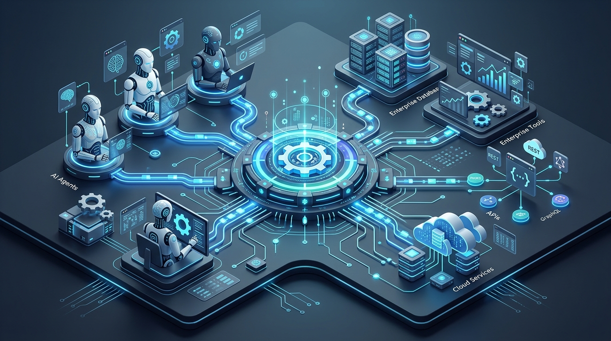
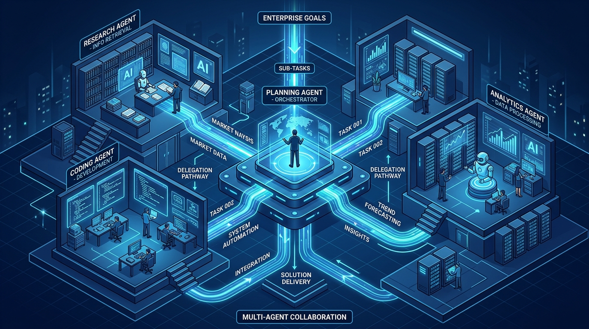
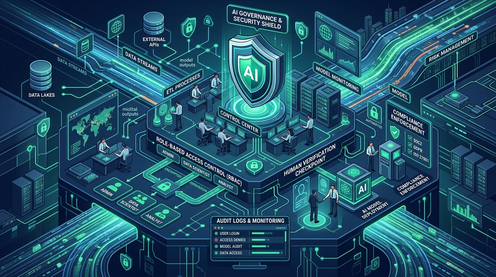

# Model Context Protocol (MCP) dan Arsitektur Multi-Agent AI

Oleh Khohar Rohman | Diperbarui: 1 Oktober 2026


*Gambar 1: Model Context Protocol (MCP) bertindak sebagai antarmuka terstandarisasi yang menghubungkan AI agent dengan basis data, API, dan sistem korporat tanpa integrasi ad-hoc.*

> ### Key Takeaways
> *   **Solusi Masalah Integrasi $N \times M$:** Model Context Protocol (MCP) menyederhanakan konektivitas AI enterprise dari relasi perkalian $N \times M$ konektor khusus menjadi relasi penambahan $N + M$ berbasis protokol terbuka universal.
> *   **Pemisahan Konektivitas dan Orkestrasi:** MCP bertindak murni sebagai protokol penyedia konteks dan peranti (*tools*), sedangkan koordinasi alur kerja tingkat lanjut dikendalikan oleh *framework* orkestrasi *Multi-Agent Systems* (MAS).
> *   **Mengatasi "Production Gap":** Riset pasar per akhir 2026 mencatat bahwa meskipun 40% aplikasi enterprise mulai menyematkan agen tugas khusus, kurang dari 7% organisasi yang sukses mencapai fase produksi penuh akibat kelemahan tata kelola data dan arsitektur perantara.
> *   **Kepatuhan Hukum dan Doktrin Kontrol Manusia:** Penggelaran agen otonom di Indonesia wajib mematuhi UU Pelindungan Data Pribadi (UU PDP No. 27/2022) dan mengadopsi prinsip *human-in-the-loop* sesuai SE Menkominfo No. 9/2023 guna memitigasi risiko hukum dan manipulasi data otomatis.

---

## Krisis Integrasi $N \times M$ dalam Transformasi AI Korporat

Pergeseran lanskap kecerdasan artifisial dari model percakapan pasif (*conversational AI*) menuju sistem otonom bertindak (*agentic AI*) telah mengubah prioritas departemen teknologi informasi di berbagai belahan dunia [1]. Jika pada fase awal perusahaan berfokus pada eksperimen *prompting* dan pembuatan purwarupa internal, kini tantangan terbesar bergeser ke ranah integrasi operasional: bagaimana menghubungkan model bahasa besar (*Large Language Models* / LLM) dengan data dinamis, sistem warisan (*legacy systems*), dan infrastruktur peranti korporat yang tersebar di lingkungan komputasi awan maupun *on-premise* [2].

Sebagaimana telah diulas dalam kajian [Transformasi Lanskap Kecerdasan Artifisial](Artikel%20Blog%20Pemanfaatan%20AI.md), keberhasilan adopsi teknologi sangat ditentukan oleh perancangan ulang proses kerja dan kesiapan tata kelola internal [10]. Namun, ketika organisasi mencoba membangun agen otonom yang mampu menjalankan tindakan bisnis riil—seperti mengekstrak data dari basis data keuangan, memeriksa ketersediaan inventaris di ERP, atau menerbitkan tiket insiden di sistem IT—mereka langsung terbentur oleh apa yang dikenal para arsitek perangkat lunak sebagai **masalah integrasi $N \times M$** (*the $N \times M$ integration problem*) [1, 3].

Bayangkan sebuah perusahaan yang menguji $N$ model AI atau aplikasi agen berbeda (seperti Claude, ChatGPT, Gemini, atau model lokal *open-source*) dan membutuhkan akses ke $M$ sumber data serta peranti internal (seperti SAP, Salesforce, PostgreSQL, GitHub, Jira, dan Slack). Tanpa adanya protokol komunikasi yang seragam, tim pengembang terpaksa membangun dan memelihara konektor khusus untuk setiap pasang kombinasi ($N \times M$) [3]. Jika ada 5 model agen dan 10 sistem korporat, tim harus merancang 50 jembatan API khusus. Setiap kali salah satu API pihak ketiga memperbarui versinya atau model AI baru diperkenalkan, arsitektur integrasi tersebut rentan patah, membengkakkan biaya pemeliharaan (*integration tax*), dan membuka celah kerentanan keamanan yang fatal [2, 4].

Kerapuhan arsitektur ad-hoc inilah yang melahirkan kebutuhan mendesak akan sebuah standar antarmuka universal terbuka—sebuah peran yang kini diambil alih oleh **Model Context Protocol (MCP)** [1, 2].

---

## Anatomi Model Context Protocol (MCP): Standar Terbuka Universal

Model Context Protocol (MCP) adalah standar protokol terbuka yang awalnya dirilis oleh Anthropic pada November 2024 dan kini telah dipayungi oleh yayasan netral *Agentic AI Foundation* di bawah Linux Foundation [1, 3]. MCP dirancang dengan filosofi sederhana namun revolusioner: menyediakan antarmuka universal yang sering dijuluki sebagai **"port USB-C untuk kecerdasan artifisial"** [1, 2]. 

Sama seperti USB-C yang menstandarisasi koneksi kabel fisik untuk periferal apa pun, MCP memungkinkan agen AI apa pun terhubung secara instan dan aman ke repositori data, peranti eksekusi, serta layanan korporat mana pun yang telah mengimplementasikan protokol tersebut [1, 3].

```
+--------------------------------------------------------------+
|                        MCP HOST                              |
|       (Aplikasi Pengguna / Lingkungan Kerja AI / IDE)        |
|                                                              |
|   +------------------------------------------------------+   |
|   |                      MCP CLIENT                      |   |
|   |         (Proses Penghubung Protokol Terkelola)       |   |
|   +------------------------------------------------------+   |
+------------------------------+-------------------------------+
                               |
                   Protokol JSON-RPC 2.0
              (Transport: stdio / HTTP-SSE)
                               |
                               v
+--------------------------------------------------------------+
|                        MCP SERVER                            |
|    (Penyedia Data, Layanan API, dan Eksekusi Korporat)       |
|                                                              |
|   [ Resources ]           [ Prompts ]           [ Tools ]    |
| (Data Pasif URI)      (Templat Konteks)      (Fungsi Aktif)  |
+--------------------------------------------------------------+
```

### 1. Tiga Komponen Arsitektur: Host, Client, dan Server
Secara arsitektural, MCP bekerja menggunakan pola *client-server* yang beroperasi melalui mekanisme pertukaran pesan yang terdefinisi secara ketat [1, 2]:
*   **MCP Host:** Aplikasi tingkat atas yang berinteraksi langsung dengan pengguna atau pengembang (misalnya AI IDE, lingkungan desktop analitik, atau platform agen korporat). Host bertugas mengkoordinasikan izin akses dan menampilkan luaran [1].
*   **MCP Client:** Komponen internal di dalam host yang memelihara sesi koneksi dua arah (*bidirectional*) dengan satu atau beberapa server MCP tertentu [1].
*   **MCP Server:** Program atau *microservice* ringan yang membungkus sumber data atau peranti internal organisasi, lalu mengekspos kapabilitasnya ke client dalam format protokol yang seragam [1, 3].

### 2. Tiga Primitif Inti: Resources, Prompts, dan Tools
Spesifikasi resmi MCP membagi pertukaran informasi ke dalam tiga primitif data yang fundamental [1, 2]:
*   **Resources (Sumber Daya):** Data pasif berbasis identifikasi URI (seperti file teks, skema tabel basis data relasional, log audit, atau rekaman API) yang bersifat *read-only*. Model AI dapat membaca data ini untuk melengkapi pemahaman konteksnya tanpa menimbulkan efek samping pada sistem produksi [1].
*   **Prompts (Instruksi Terstruktur):** Templat instruksi atau alur percakapan kontekstual yang diekspos oleh server untuk memandu model dalam menjalankan alur kerja spesifik secara konsisten lintas tim [1].
*   **Tools (Peranti Eksekutif):** Fungsi komputasi yang dapat dipanggil dan dieksekusi secara dinamis oleh model AI dengan argumen tervalidasi skema JSON [1, 4]. Berbeda dengan *Resources*, pemanggilan *Tools* memiliki efek samping operasional (*stateful side effects*), seperti memperbarui status tiket ERP, melakukan transaksi saldo, atau mengirim sinyal webhook ke layanan lain [2].

### 3. Protokol Komunikasi JSON-RPC 2.0 dan Jalur Transportasi
Seluruh interaksi dalam ekosistem MCP dibungkus menggunakan spesifikasi **JSON-RPC 2.0** [1, 2]. Pemilihan format standar ini memastikan bahwa pertukaran instruksi bersifat deterministik, independen terhadap bahasa pemrograman, dan mudah divalidasi oleh skema tipe (*typed schema validation*) [4].

Untuk transmisi datanya, MCP mendukung dua mekanisme transportasi utama [1]:
1.  **Standar Masukan/Keluaran (`stdio`):** Digunakan saat client dan server berjalan di mesin lokal atau *container* yang sama. Jalur ini sangat cepat, terisolasi secara proses sistem operasi, dan tidak terpapar jaringan luar [1, 4].
2.  **Server-Sent Events melalui HTTP (`SSE`):** Digunakan untuk arsitektur enterprise terdistribusi di mana client berkomunikasi dengan server MCP jarak jauh (*remote server*) melalui jaringan privat atau *cloud gateway* [1, 4].

---

## MCP vs Framework Orkestrasi Multi-Agen: Memisahkan Konektivitas dan Logika Kerja

Salah satu kesalahpahaman paling umum di kalangan praktisi teknologi adalah menganggap MCP sebagai pesaing atau pengganti kerangka kerja orkestrasi seperti LangGraph, CrewAI, AutoGen, atau Microsoft Semantic Kernel [2, 3]. Faktanya, kedua elemen ini berada pada lapisan arsitektur yang sama sekali berbeda dan saling melengkapi [2].

**MCP adalah lapisan konektivitas dan pertukaran konteks (*connectivity & context layer*), sedangkan kerangka kerja agen adalah lapisan logika dan orkestrasi alur kerja (*orchestration & reasoning layer*)** [2, 3].

| Dimensi Perbandingan | Model Context Protocol (MCP) | Framework Orkestrasi Multi-Agent (MAS) |
| :--- | :--- | :--- |
| **Posisi Arsitektural** | Lapisan Antarmuka & Protokol Data (*Plumbing*) | Lapisan Kognitif & Orkestrasi Kerja (*Brain & Coordination*) |
| **Tanggung Jawab Utama** | Menyediakan akses seragam ke data (*Resources*) dan aksi (*Tools*) | Mengatur logika perencanaan (*planning*), pembagian tugas, dan evaluasi hasil |
| **Pengelolaan Status (*State*)** | Bersifat *stateless* (menangani siklus panggilan per instruksi) | Menyimpan riwayat memori, graf dependensi alur kerja, dan *agent state* |
| **Analogi Sistem** | Stopkontak dan kabel universal (USB-C / Ethernet) | Rapat koordinasi direksi dan manajer operasional proyek |
| **Contoh Teknologi** | Spesifikasi MCP Anthropic / Agentic AI Foundation | LangGraph, CrewAI, AutoGen, Semantic Kernel, Bedrock AgentCore |


*Gambar 2: Dalam arsitektur Multi-Agent System (MAS), agen perencana (Planning Agent) mendelegasikan subtugas ke agen riset, koding, dan analitik, di mana seluruh agen mengakses data enterprise melalui lapisan protokol MCP.*

Dalam riset empiris yang dipublikasikan oleh Krishnan (2025), integrasi MCP ke dalam sistem multi-agen (*Multi-Agent Systems* / MAS) terbukti meningkatkan ketahanan sistem dan efisiensi koordinasi secara signifikan [2]. 

Ketika sebuah *Planning Agent* (agen perencana) bertugas menyusun laporan kelayakan pasar, ia tidak perlu lagi memiliki kode integrasi langsung ke puluhan basis data [2, 3]. Agen perencana cukup mendelegasikan tugas ke *Research Agent*, *Analytics Agent*, dan *Auditing Agent*. Masing-masing agen spesialis tersebut kemudian memanggil server MCP yang relevan untuk menarik data atau memicu analisis dengan format yang seragam [2]. 

Jika di kemudian hari sistem basis data perusahaan dimigrasikan dari PostgreSQL ke BigQuery atau Snowflake, pengembang hanya perlu memperbarui satu server MCP tanpa perlu merombak logika kognitif atau *prompting* pada agen-agen yang terlibat [1, 2].

---

## Realitas Pasar 2026: Mengapa 40% Inisiatif Agen AI Terancam Gagal?

Di tengah antusiasme yang masif terhadap agen otonom, data pasar per kuartal akhir 2026 memperlihatkan disonansi yang nyata antara ekspektasi manajemen puncak dan realisasi di lantai produksi komersial [5, 6, 7].

Lembaga riset global **Gartner** memproyeksikan bahwa **40% aplikasi enterprise** akan menyematkan agen AI berbasis tugas pada akhir tahun 2026, meningkat pesat dari proporsi di bawah 5% pada awal 2025 [5]. Selain itu, belanja global untuk platform dan model AI diproyeksikan menyentuh angka **$64 Miliar pada tahun 2026**, tumbuh sebesar 63,4% secara tahunan (*year-over-year*) [5].

Namun, di balik kurva pertumbuhan belanja tersebut, terdapat jurang implementasi (*production gap*) yang mengkhawatirkan [6, 7]:
*   **Forrester Research (2026)** mencatat bahwa kendati sekitar **75% pemimpin enterprise** telah mengumumkan adopsi inisiatif *agentic AI*, mayoritas implementasi tersebut masih terperangkap dalam status chatbot eksperimental berfitur terbatas (*"agentish"*), bukan sistem multi-agen yang mandiri [6].
*   **IDC MarketScape (2026)** menemukan fakta bahwa **kurang dari 7% organisasi enterprise** yang telah benar-benar menjalankan setidaknya satu beban kerja agen otonom dalam skala produksi komersial penuh [7].
*   **Peringatan Risiko Gartner (2026):** Lebih dari **40% proyek inisiatif Agentic AI diperkirakan akan dibatalkan sebelum akhir tahun 2027** [5]. Faktor utama kegagalan bukan terletak pada kecerdasan model bahasa, melainkan akibat eskalasi biaya komputasi yang tidak terkendali (*token inflation*), ketidakmampuan membuktikan nilai imbal hasil investasi (*Return on Investment* / ROI), dan rapuhnya kontrol tata kelola keamanan [5].

Gartner juga menambahkan proyeksi kritis bahwa hingga 70% korporasi yang membangun solusi agen AI melalui konsultan perantara atau model *forward-deployed engineering* (FDE) berisiko menelantarkan sistem mereka pada tahun 2028 jika tidak membangun kompetensi arsitektur dan kepemilikan internal atas lapisan data mereka sendiri [5]. 

Di sinilah adopsi standar terbuka seperti MCP menjadi aset strategis: organisasi tidak terjebak dalam ekosistem tertutup vendor tertentu (*vendor lock-in*) dan mempertahankan kedaulatan atas sistem data mereka [1, 3].

---

## Tata Kelola, Keamanan Terpusat (*Control Plane*), dan Kepatuhan Regulasi

Membuka sistem inti korporat kepada agen AI otonom membawa risiko keamanan siber yang eksponensial [4]. Jika integrasi AI generasi awal hanya berisiko membocorkan teks percakapan, pemanggilan *Tools* pada agen AI otonom membawa risiko eksekusi transaksi yang tidak diinginkan, kerusakan data permanen, hingga eksfiltrasi data rahasia perusahaan [4].


*Gambar 3: Lapisan kontrol terpusat (Control Plane) memastikan setiap pemanggilan MCP diverifikasi melalui otentikasi peran (RBAC), penyaringan prompt injection, audit logging, dan titik verifikasi manusia.*

### 1. Mengamankan Remote MCP: Menghapus Kerentanan *Text-to-SQL*
Salah satu keunggulan terbesar MCP dibanding pendekatan lama adalah eliminasi metode *unconstrained text-to-SQL* [3, 4]. Pada pendekatan konvensional, model AI diberikan akses langsung untuk menghasilkan dan menjalankan perintah SQL mentah ke basis data. Hal ini memicu risiko bencana: serangan injeksi *prompt* (*prompt injection*) dapat memanipulasi model untuk menjalankan perintah `DROP TABLE` atau mencuri data sensitif pelanggan [4].

Melalui MCP, akses data dibatasi oleh kontrak fungsi bertipe ketat (*typed tool contracts*) [4]. Model AI tidak pernah mengeksekusi SQL secara langsung; model hanya diizinkan memilih peranti fungsi yang telah ditentukan sebelumnya (misalnya: `get_customer_balance(customer_id)`) [1, 4]. Validasi parameter dilakukan di sisi server MCP sebelum fungsi dieksekusi [4].

Sebagaimana dipaparkan dalam kajian keamanan siber oleh Simões et al. (2026) di jurnal *Applied Sciences* (MDPI), implementasi MCP di lingkungan operasional sensitif (seperti *Security Operations Center* / SOC) wajib menambahkan lapisan perantara (*Control Plane*) yang memuat [4]:
1.  **Otorisasi Berbasis Peran (*Role-Based Access Control* / RBAC):** Memastikan agen hanya dapat melihat dan memanggil peranti yang sesuai dengan tingkat privilese tugasnya [4].
2.  **Penyaringan Parameter & Uji Kewajaran (*Sanitization Gateways*):** Memindai argumen masukan untuk mendeteksi anomali atau upaya pembobolan instruksi secara otomatis [4].
3.  **Pencatatan Audit yang Tak Dapat Diubah (*Immutable Audit Trail*):** Menyimpan rekam jejak lengkap mengenai agen mana yang memanggil fungsi, waktu eksekusi, parameter yang dikirimkan, serta respon sistem untuk keperluan forensik digital dan audit kepatuhan [4].

### 2. Kepatuhan Hukum: UU PDP dan SE Menkominfo No. 9/2023 di Indonesia
Dalam konteks yurisdiksi Indonesia, penggelaran sistem agen AI otonom berhadapan langsung dengan dua kerangka kepatuhan vital:

*   **Undang-Undang Nomor 27 Tahun 2022 tentang Pelindungan Data Pribadi (UU PDP):** Pasca berakhirnya masa transisi penyesuaian, sanksi administratif dan tuntutan ganti rugi perdata kini berlaku penuh terhadap kegagalan pengendali data dalam menjaga kerahasiaan data pribadi [9]. Jika sebuah agen AI enterprise mengekstrak data identitas kependudukan, rekam medis, atau nomor rekening nasabah melalui panggilan API dan mengirimkannya ke penyedia LLM publik di luar batas yurisdiksi tanpa enkripsi dan persetujuan yang sah, entitas bisnis tersebut berhadapan dengan ancaman sanksi denda maksimal hingga 2% dari total pendapatan tahunan [9].
*   **Surat Edaran Menkominfo Nomor 9 Tahun 2023 tentang Etika Kecerdasan Artifisial:** SE ini menggariskan 9 nilai etika utama, dengan penegasan tegas pada prinsip **akuntabilitas, transparansi, dan kemanusiaan** [8]. Poin paling fundamental dalam SE ini melarang AI digunakan sebagai pemutus tunggal (*sole decision-maker*) pada ranah kebijakan publik atau keputusan kritis yang menyangkut langsung harkat kemanusiaan (*human life-critical decisions*) [8].

Berdasarkan landasan regulasi ini, arsitektur multi-agen enterprise modern wajib mengadopsi mekanisme **Human-in-the-Loop (HITL)** pada peranti berisiko tinggi (*high-stakes tools*) [4, 8]. Dalam protokol MCP, hal ini diwujudkan melalui alur otorisasi tertunda: ketika agen memanggil peranti penarikan dana atau persetujuan pinjaman kredit, server MCP tidak langsung mengeksekusi operasi tersebut, melainkan menerbitkan permintaan verifikasi kepada peninjau manusia (*human approver*) sebelum status transaksi difinalisasi [4].

---

## Panduan Strategis Implementasi Bertahap bagi Manajemen Bisnis

Untuk menghindari jebakan pembatalan proyek sebagaimana diperingatkan oleh Gartner, pimpinan teknologi dan manajemen bisnis disarankan menempuh pendekatan implementasi modular 4 tahap [2, 5]:

```
+----------------------------------------------------------------------------+
| FASE 1: AUDIT & MCP WRAPPING                                               |
| Inventarisasi API internal; bungkus 1-2 sistem kritis menjadi MCP Server. |
+-------------------------------------+--------------------------------------+
                                      |
                                      v
+----------------------------------------------------------------------------+
| FASE 2: PILOT SINGLE-AGENT WORKFLOW                                        |
| Terapkan 1 agen berfokus internal (misal: analisis log IT atau asistensi).  |
+-------------------------------------+--------------------------------------+
                                      |
                                      v
+----------------------------------------------------------------------------+
| FASE 3: ENTERPRISE CONTROL PLANE                                           |
| Pasang gerbang autentikasi OAuth 2.0, audit logging, RBAC, dan HITL gate.  |
+-------------------------------------+--------------------------------------+
                                      |
                                      v
+----------------------------------------------------------------------------+
| FASE 4: MULTI-AGENT COLLABORATIVE ECOSYSTEM                                |
| Aktifkan kolaborasi lintas agen dengan pembagian peran kognitif modular.   |
+----------------------------------------------------------------------------+
```

### Tahap 1: Inventarisasi dan Pembungkusan API (*MCP Wrapping*)
Langkah awal bukanlah membeli platform AI mahal, melainkan menginventarisasi antarmuka pemrograman aplikasi (API) yang sudah ada di perusahaan. Pilih 1–2 sistem data internal dengan nilai bisnis terukur (misalnya basis data FAQ produk atau katalog inventaris). Bangun server MCP ringan yang membungkus endpoint tersebut dan mengeksposnya sebagai *Resources* dan *Tools* berdokumen skema ketat [1, 2].

### Tahap 2: Pengujian Alur Kerja Agen Tunggal (*Single-Agent Pilot*)
Ujicobakan server MCP tersebut pada satu use-case internal dengan toleransi risiko terkendali, seperti asisten teknisi dukungan pelanggan internal atau asisten penelusuran dokumentasi kode tim pengembang. Ukur metrik dasarnya: waktu pencarian data, akurasi perolehan jawaban, dan latensi komputasi [2, 10].

### Tahap 3: Pembangunan Lapisan Kontrol Terpusat (*Enterprise Control Plane*)
Sebelum membuka akses ke lingkungan produksi yang lebih luas, integrasikan lapisan otentikasi identitas korporat (seperti SSO/OAuth 2.0). Terapkan *Human-in-the-Loop Gate* untuk setiap aksi yang berpotensi mengubah kondisi basis data, serta pastikan seluruh lalu lintas JSON-RPC diaudit secara real-time guna memenuhi kepatuhan UU PDP [4, 9].

### Tahap 4: Orkestrasi Ekosistem Multi-Agen Kolaboratif (*Multi-Agent Orchestration*)
Setelah lapisan konektivitas data (MCP) dan tata kelola terbukti stabil, barulah organisasi menerapkan *framework* orkestrasi multi-agen (seperti LangGraph atau Semantic Kernel). Setiap agen diberikan domain tugas spesifik (Agen Peneliti, Agen Analis Keuangan, Agen Penulis Laporan) yang berkoordinasi secara otonom untuk menyelesaikan alur kerja bisnis lintas departemen [2, 3].

---

## Kesimpulan dan Rekomendasi Manajerial

Sebagaimana ditekankan oleh Khohar Rohman dalam berbagai telaah arsitektur kecerdasan artifisial, lompatan produktivitas dari teknologi cerdas tidak pernah lahir dari sekadar kecanggihan model bahasa semata, melainkan dari kedisiplinan arsitektur sistem dan integrasi proses bisnis yang terstruktur. 

Model Context Protocol (MCP) telah membuktikan perannya sebagai fondasi standar terbuka yang berhasil meruntuhkan dinding pembatas integrasi $N \times M$ yang selama ini melumpuhkan inisiatif AI korporat [1, 3]. Dengan memisahkan secara tegas antara lapisan konektivitas data dan lapisan orkestrasi kognitif, MCP memberikan fleksibilitas jangka panjang bagi perusahaan untuk mengganti, meningkatkan, atau memadukan berbagai model AI tanpa harus merombak fondasi data mereka [2].

Kendati demikian, para pengambil keputusan teknologi harus senantiasa mengingat peringatan data pasar per akhir 2026: kecanggihan protokol tidak akan mampu menutupi ketiadaan tata kelola [5]. Keberhasilan sejati implementasi sistem multi-agen berada pada titik temu antara efisiensi integrasi teknis, ketatnya kontrol keamanan data pribadi sesuai UU PDP No. 27/2022, serta kepatuhan mutlak pada prinsip etika dan pengawasan manusia sesuai amanat SE Menkominfo No. 9/2023 [4, 8, 9]. Masa depan otomatisasi enterprise bukan tentang menyerahkan kendali bisnis seutuhnya kepada mesin otonom, melainkan membangun orkestrasi kolaboratif di mana kecerdasan komputasi beroperasi di bawah koridor akuntabilitas manusia [8, 10].

---

## Pertanyaan yang Sering Diajukan (FAQ)

### 1. Apakah Model Context Protocol (MCP) menggantikan REST API atau GraphQL yang sudah ada di korporasi?
Tidak. MCP tidak menggantikan REST API atau GraphQL, melainkan bertindak sebagai jembatan perantara semantik (*semantic wrapper*). Server MCP membungkus (*wraps*) endpoint REST API atau kueri GraphQL internal yang sudah ada, lalu menerjemahkannya ke dalam format kontrak *Tools* dan *Resources* standar JSON-RPC 2.0 agar dapat dipahami dan dipanggil secara deterministik oleh agen AI [1, 3].

### 2. Apa perbedaan mendasar antara MCP dan Function Calling bawaan dari penyedia LLM?
*Function Calling* konvensional adalah mekanisme inferensi bawaan model tertentu untuk menghasilkan sintaksis pemanggilan fungsi JSON, namun implementasi eksekusi kodenya harus ditulis manual secara berbeda pada setiap penyedia model (OpenAI, Anthropic, Google). MCP adalah protokol terbuka standar industri yang mengabstraksi seluruh proses tersebut secara universal: sekali Anda membuat satu MCP Server untuk basis data Anda, server tersebut dapat dikonsumsi oleh model dan aplikasi AI apa pun yang mematuhi standar MCP tanpa perlu menulis ulang kode konektor [1, 2].

### 3. Mengapa sistem multi-agen enterprise memerlukan verifikasi manusia (*Human-in-the-Loop*)?
Verifikasi manusia diperlukan untuk memitigasi risiko halusinasi, kesalahan logika pemanggilan fungsi, dan potensi tindakan fatal pada sistem produksi (seperti transfer dana atau penghapusan data). Selain itu, di Indonesia, SE Menkominfo No. 9/2023 dan UU PDP No. 27/2022 mewajibkan akuntabilitas hukum dan melarang sistem otonom mengambil keputusan akhir yang berdampak langsung pada hak hukum dan keselamatan manusia tanpa diskresi peninjau manusia yang kompeten [4, 8, 9].

---

## Diskusi dan Tanggapan Anda

Bagaimana strategi organisasi atau tim rekayasa teknologi Anda dalam mengatasi kompleksitas integrasi sistem AI saat ini? Apakah perusahaan Anda telah mulai mengadopsi standar Model Context Protocol (MCP) untuk membungkus sistem internal, ataukah masih mengandalkan konektor API ad-hoc?

Bagikan pengalaman, pandangan teknis, dan tantangan implementasi yang Anda hadapi di kolom komentar di bawah ini untuk mendiskusikannya bersama komunitas teknologi enterprise.

---

## Tentang Penulis

**Khohar Rohman** adalah Direktur PT Aigarn Akademi Artificial dan mahasiswa aktif Politeknik Negeri Malang. Ia aktif meneliti dan menulis tentang perkembangan *artificial intelligence*, arsitektur teknologi perangkat lunak, transformasi bisnis digital, dan manajemen operasional berbasis teknologi.

*Tautan Profil:* [LinkedIn](https://www.linkedin.com) | [GitHub](https://github.com/khohar25) | [Google Scholar](https://scholar.google.com)

*Keterbukaan Informasi:* Penulis adalah direktur PT Aigarn Akademi Artificial. Pembahasan dalam artikel ini disusun secara objektif dan independen untuk tujuan edukasi serta kajian arsitektur teknologi komputasi, tanpa bentuk periklanan komersial terselubung.

---

## Kredit Gambar

1.  **Nama File:** `assets/mcp-arsitektur-enterprise-hero.jpg`  
    **Deskripsi:** Ilustrasi konseptual arsitektur Model Context Protocol (MCP) sebagai hub universal yang menghubungkan agen AI dengan basis data dan layanan korporat.  
    **Pembuat:** Tim Redaksi Artikel Khohar Rohman (AI-Generated via Custom Enterprise Prompt).  
    **Lisensi:** Domain Publik / Creative Commons Zero (CC0) Dedication. Aman untuk penggunaan edukasi dan komersial tanpa royalti.
2.  **Nama File:** `assets/multi-agent-orchestration-enterprise.jpg`  
    **Deskripsi:** Diagram alur koordinasi sistem multi-agen (MAS) yang memetakan pembagian tugas antara agen perencana dan agen spesialis.  
    **Pembuat:** Tim Redaksi Artikel Khohar Rohman (AI-Generated via Custom Enterprise Prompt).  
    **Lisensi:** Domain Publik / Creative Commons Zero (CC0) Dedication. Aman untuk penggunaan edukasi dan komersial tanpa royalti.
3.  **Nama File:** `assets/tata-kelola-keamanan-ai-enterprise.jpg`  
    **Deskripsi:** Visualisasi pusat kontrol keamanan tata kelola AI enterprise mencakup RBAC, audit log, dan pos verifikasi manusia.  
    **Pembuat:** Tim Redaksi Artikel Khohar Rohman (AI-Generated via Custom Enterprise Prompt).  
    **Lisensi:** Domain Publik / Creative Commons Zero (CC0) Dedication. Aman untuk penggunaan edukasi dan komersial tanpa royalti.

---

## Sumber / Daftar Pustaka

1. Anthropic. (2024). *Introducing the Model Context Protocol: An open standard for connecting AI models to data sources*. Anthropic Engineering. https://www.anthropic.com/news/model-context-protocol. (Diakses: 1 Oktober 2026).
2. Krishnan, N. (2025). *Advancing Multi-Agent Systems Through Model Context Protocol: Architecture, Implementation, and Applications*. arXiv preprint arXiv:2504.03264. https://doi.org/10.48550/arXiv.2504.03264. (Diakses: 1 Oktober 2026).
3. Venkiteela, P. (2025). *The New Interoperability Paradigm: Model Context Protocol (MCP), APIs, and the Future of Agentic AI*. Computer Fraud & Security, 2025(3), 112–124. https://doi.org/10.1016/j.cfs.2025.101124. (Diakses: 1 Oktober 2026).
4. Simões, R. T. P., Larriva-Novo, X., Sánchez-Zas, C., Villagrá, V. A., & Marín López, A. I. (2026). *Design of a Security Framework for Multi-Agent Systems Based on Model Context Protocol in SOC Environments*. Applied Sciences, 16(16), 7915. https://doi.org/10.3390/app16167915. (Diakses: 1 Oktober 2026).
5. Gartner. (2026). *Gartner Identifies Top Strategic Technology Trends for 2026: Autonomous Agents and Multi-Agent Systems*. Gartner Research Press Releases. https://www.gartner.com/en/newsroom. (Diakses: 1 Oktober 2026).
6. Forrester. (2026). *The State of Agentic AI in the Enterprise 2026: Bridging the Gap Between Pilots and Production*. Forrester Research Report. https://www.forrester.com/research. (Diakses: 1 Oktober 2026).
7. IDC. (2026). *Worldwide Agentic AI Adoption and Enterprise Application Forecast, 2025–2027*. IDC MarketScape Report. https://www.idc.com. (Diakses: 1 Oktober 2026).
8. Kementerian Komunikasi dan Informatika Republik Indonesia. (2023). *Surat Edaran Menteri Komunikasi dan Informatika Nomor 9 Tahun 2023 tentang Etika Kecerdasan Artifisial*. JDIH Kominfo. https://jdih.komdigi.go.id/produk_hukum/view/id/883. (Diakses: 1 Oktober 2026).
9. Pemerintah Republik Indonesia. (2022). *Undang-Undang Republik Indonesia Nomor 27 Tahun 2022 tentang Pelindungan Data Pribadi*. Lembaran Negara Republik Indonesia Tahun 2022 Nomor 196. https://peraturan.go.id/id/uu-no-27-tahun-2022. (Diakses: 1 Oktober 2026).
10. Aulia, R., & Rahmadi, F. (2024). *Exploring the Relationship between Artificial Intelligence and Business Performance: Structural Equation Modeling Analysis*. Indonesian Journal of Computing and Cybernetics Systems (IJCCS), 18(2), 145–158. https://doi.org/10.22146/ijccs.86697. (Diakses: 1 Oktober 2026).
